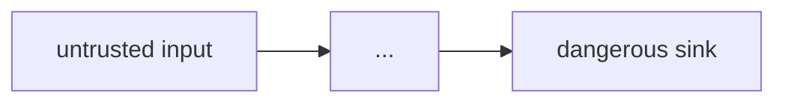
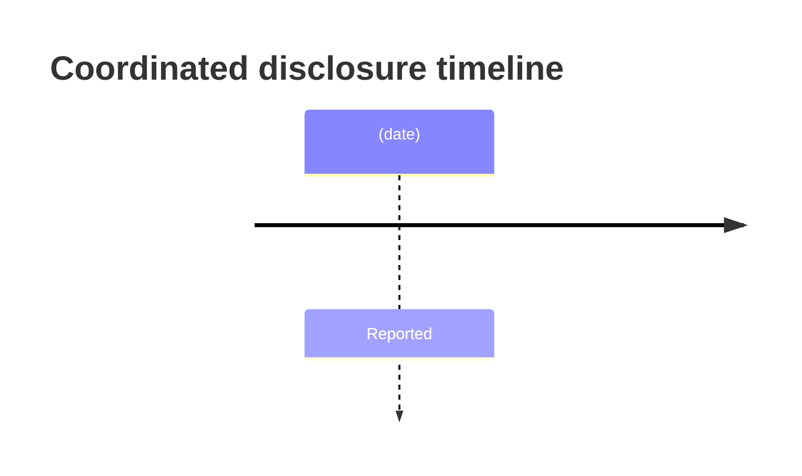

# Security Briefing — {{TARGET}} ({{DATE}})

*Audience: technical + government. One page. Every claim traces to evidence.*

## Bottom line up front (BLUF)
> One paragraph: what was assessed, the top risk, and the recommended action.
> A decision-maker should get the point from this alone.

## Attack surface / top candidates

<!-- chart.py bars --csv diff-out/diff-candidates.csv --label path --value score --top 8 --title "..." --out chart-candidates.svg -->

## Findings by severity

<!-- chart.py bars --csv findings.csv --label finding --value cvss --color-by severity --title "..." --out chart-findings.svg -->

| Finding | CVSS | Class (CWE) | Pre-auth? | Status |
|---------|:----:|-------------|:---------:|--------|
|         |      |             |           |        |

## How the top finding works (taint path)
<!-- diagram.py taint "source" "..." "sink" -->

## Disclosure status
<!-- diagram.py timeline --finding finding.json -->

## Recommendation
> The one or two actions the audience should take (patch, mitigate, prioritize).
