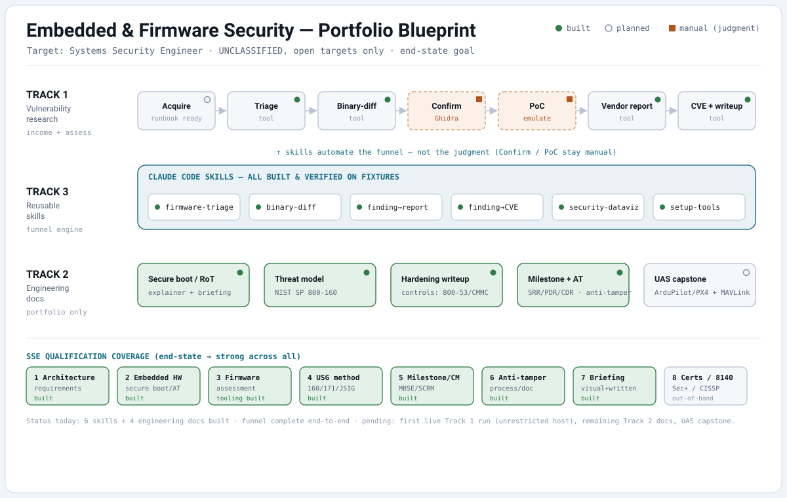

# Embedded & Firmware Security Research

A working portfolio of firmware/embedded-security assessment, reusable analysis
tooling, and milestone-style security engineering documentation. Everything here
is built on **open-source, commercial, or academic targets** and is intended to
demonstrate transferable systems-security-engineering skills.



> **Scope & ethics.** UNCLASSIFIED, publicly-available targets only. All firmware
> is acquired from vendors' public support sites. No proprietary, classified, or
> export-controlled (ITAR/EAR) technical data is reproduced or generated here.
> Vulnerability research follows coordinated disclosure — see
> [`docs/disclosure-policy.md`](docs/disclosure-policy.md). Firmware binaries are
> never redistributed in this repository (see `.gitignore`).

## What's here

This repo is organized around three tracks:

| Track | Focus | What lands here |
|-------|-------|-----------------|
| **1 — Vulnerability research** | Commercial embedded devices (SOHO routers) | Sanitized public writeups, CVEs, and the tooling that produced them |
| **2 — Security engineering docs** | Open embedded platforms | Threat models, hardening writeups, architecture + anti-tamper docs in USG methodology language |
| **3 — Reusable tooling** | Repeatable workflows | Claude Code Skills, Ghidra scripts, emulation configs, chart/diagram generators |

The full deliverable plan, with each artifact mapped to a named Systems Security
Engineer competency, is in [`docs/artifact-plan.md`](docs/artifact-plan.md) and
[`docs/qualification-map.md`](docs/qualification-map.md).

## Repository map

```
docs/
  artifact-plan.md            Concrete plan across all three tracks (built/planned status)
  qualification-map.md        Every artifact -> a specific SSE competency + coverage snapshot
  portfolio-blueprint.svg     One-image end-state blueprint (the banner above)
  NEXT-SESSION.md             Two restart paths (Track 1 live run · P5.1 capstone)
  audit-2026-09-18.md         Consistency/hygiene audit + consolidated next-steps roadmap
  disclosure-policy.md        Coordinated disclosure + legal/ethics scope
  track1-target-selection.md  Target choice: rubric + freshness pass + CVE-volume reorder
  track1-acquisition-runbook.md  Turnkey P1.1: acquire -> confirm SoC -> triage -> diff -> dedup
  track2/
    secure-boot-root-of-trust.md                        RoT, verified/measured boot, keys, anti-tamper
    fpga-security-reference.md                          P6.1 FPGA secure config: bitstream auth/encryption, eFUSE/PUF keys, RoT into PL
    uas-autopilot-threat-model.md                       NIST SP 800-160 threat model (ArduPilot/PX4 + MAVLink)
    embedded-hardening-writeup.md                       Hardening a real Linux node -> 800-53/CMMC controls
    uas-mavlink-hardening.md                            Remediation for the capstone findings (signing, anti-replay, link encryption)
    milestone-security-architecture-and-anti-tamper.md  SRR->PRR gates, MBSE, DoD anti-tamper
    uas-capstone-assessment.md                          P5.1 hands-on MAVLink T&E vs SITL (executes the threat model)
    uas-security-brief.html                             P6.3 leadership brief (self-contained slide deck; open in a browser)
.claude/skills/                Reusable Claude Code Skills (the assessment funnel)
  firmware-triage/             extract -> inventory -> sink-scan  (triage.sh, sink_scan.py, setup-tools.sh)
  binary-diff/                 version-to-version diff -> ranked candidates  (fw_diff.py)
  finding-to-vendor-report/    confirmed finding -> CVSS-scored PSIRT report  (cvss.py, make_report.py)
  finding-to-cve-writeup/      disclosed finding -> CVE JSON 5.1 + writeup  (make_cve.py, sanitize_check.py)
  security-dataviz/            analysis output -> briefing charts + diagrams  (chart.py, diagram.py)
tools/
  mavlink-sectest/             MAVLink security test harness for ArduPilot/PX4 SITL (P5.1 T&E)
  mavlink-signing/             P6.2 build spec: Rust MAVLink v2 signing module (closes T1/T5)
  run-checks.sh                Repo verification: lints, self-tests, SVG/mermaid/link checks
research/
  dlink-rtl819x/               Run 1 working area: acquisition log + hashes, the extract->diff
                               runner, and Ghidra headless diff scripts (n-day case study)
  zyxel-cpe/                   Run 2 working area: target notes + acquisition log — blocked at
                               acquisition (2026 patched CPE firmware is ISP-gated, not public)
  draytek-vigor/               Run 3 working area: Vigor300B fingerprint, diff sweep, dedup
                               ledger, reusable Ghidra scripts, and the code-level finding
                               deduped as an n-day (CVE-2024-45890)
                               (paperwork + tooling tracked; firmware blobs git-ignored)
writeups/
  dir-816l-hnap-soapaction-cmdinjection.md  Track 1 case study: patch-diffing rediscovers an
                               n-day unauth HNAP command injection (CVE-2015-2051 class)
```

## Reusable tooling (Claude Code Skills)

These Skills encode a repeatable firmware-assessment funnel so each analysis is
faster and more consistent than the last. They are plain, auditable
files — Markdown instructions plus small scripts with no exotic dependencies.

- **firmware-triage** — Turn a firmware image into a structured triage report:
  extract the filesystem, inventory sensitive files (keys/creds/certs/SUID),
  fingerprint binary architecture and endianness, and produce a ranked list of
  binaries that call dangerous C sinks. First stage of the funnel.
- **binary-diff** — Diff an older and newer firmware version to surface
  silently-patched or newly-introduced bugs: added/removed/changed files,
  dangerous-sink deltas per binary, "silent-fix" error-string tells, and a ranked
  candidate list that names which version likely holds the bug (points Ghidra/
  Diaphora at the right function). Vendor-agnostic; consumes triage output.
- **finding-to-vendor-report** — Turn a confirmed finding into a PSIRT-ready
  report: a CVSS v3.1 calculator (verified against NVD vectors), CWE mapping, a
  report assembler that fills the template from a finding file, and a
  coordinated-disclosure cover email. Automates scoring + drafting, not judgment.
- **finding-to-cve-writeup** — Turn a disclosed finding into a submittable CVE
  JSON 5.1 record (reusing the same finding file and CVSS score) and a
  methodology-forward public writeup, with a sanitization linter that blocks key
  material, unfilled placeholders, and weaponized payloads before publishing.
- **security-dataviz** — Briefing-grade, dependency-free visuals from analysis
  output: theme-aware SVG bar charts (ranked candidates; findings colored by CVSS
  band) and native mermaid diagrams (taint paths, disclosure timelines), plus a
  one-page briefing template. Defers palette/design theory to the `dataviz` skill.

A standalone tool supports the UAS capstone:

- **mavlink-sectest** (`tools/`) — a pymavlink test harness that runs the threat
  model's requirements as automated T&E against ArduPilot/PX4 SITL (signing,
  command injection, replay, cleartext telemetry, failsafe), benign and
  simulation-first. Its output feeds the report and dataviz skills.

## Status

The tooling funnel and the engineering-document set are **built and verified on
fixtures**; what remains is hands-on execution that needs an unrestricted host.

**Built**
- **Track 3 — five reusable Skills** (firmware-triage, binary-diff,
  finding-to-vendor-report, finding-to-cve-writeup, security-dataviz) plus the
  **mavlink-sectest** harness — the full acquire → triage → diff → report → CVE →
  visualize funnel, each verified end-to-end on synthetic fixtures.
- **Track 2 — four engineering documents**: the secure-boot / root-of-trust
  explainer, the NIST SP 800-160 UAS threat model, the 800-53 / CMMC hardening
  writeup, and the milestone security architecture + anti-tamper approach — giving
  SSE competencies 1–7 real artifact coverage (see the blueprint above).
- **Track 1 — three live runs, method proven end-to-end (all findings so far dedup as n-days):**
  - **Run 1 — DIR-816L Rev B (D-Link, RTL819x MIPS-BE):** funnel exercised end-to-end
    on real vendor firmware — acquire → confirm SoC → diff the security patch → confirm
    in Ghidra → dedup. Rediscovered an unauthenticated HNAP `SOAPAction` OS command
    injection, dedup'd as an **n-day** (CVE-2015-2051 class). Case study:
    [`writeups/dir-816l-hnap-soapaction-cmdinjection.md`](writeups/dir-816l-hnap-soapaction-cmdinjection.md).
  - **Run 2 — Zyxel CPE:** fresh, active-CNA target, but **blocked at acquisition** —
    the 2026 patched CPE firmware is ISP-gated, so the fix is not provenance-acquirable
    to diff. Exposed the acquisition-feasibility gate that drove the run-3 re-pick.
  - **Run 3 — DrayTek Vigor300B (Linux/Comcerto, ARM-LE):** the funnel confirmed a
    finding at the code level, then **deduped it as an n-day**. Diffing the public
    `1.5.1.6 → 1.5.1.7` window surfaced a silent hardening of `mainfunction.cgi`; Ghidra
    decompilation + disassembly **confirmed a `download_ovpn` OS command injection** — an
    incomplete-blocklist sanitizer *bypass* that runs as **root** (post-auth
    operator/admin). On live re-check (2026-09-18) the endpoint proved to be already
    assigned as **CVE-2024-45890** (the same `download_ovpn` bug on the sibling
    Vigor3900); the initial "no matching CVE" read was a dedup miss (scoped to the 300B
    CVE list — the CVE is filed under the 3900). The 300B isn't in that CVE's CPE list, so
    what remains is a methodology case study + a possible CPE coverage-gap note, **not a
    new CVE**. Finding + evidence:
    [`research/draytek-vigor/finding-openvpn-cmdinjection.md`](research/draytek-vigor/finding-openvpn-cmdinjection.md).

**Remaining**
- **Track 1 — where a genuinely new CVE could still come from:** the DrayTek run 3 bug is
  an n-day (CVE-2024-45890), so the remaining upside is the **fan-out** — grep the same
  `download_ovpn` → `create_client_conf.sh` unquoted-args pattern across other Vigor models
  and look for a **still-supported, out-of-CPE, unpatched** one. Run 3 itself is closed out:
  the methodology case study is published at
  [`writeups/draytek-vigor300b-download_ovpn-cmdinjection.md`](writeups/draytek-vigor300b-download_ovpn-cmdinjection.md),
  and a CPE coverage-gap note to DrayTek/MITRE (CVE-2024-45890 also affects the Vigor300B) is
  drafted in [`research/draytek-vigor/`](research/draytek-vigor/) (sending it is a
  user-confirmed step). A runtime PoC on an owned/emulated ≤ 1.5.1.6 device would further
  substantiate the case study. See the top-priority item in
  [`docs/artifact-plan.md`](docs/artifact-plan.md). Disclosure obligation: handle personal
  COI / outside-activity reporting first ([`docs/disclosure-policy.md`](docs/disclosure-policy.md) §5).
- **P5.1** — the hands-on UAS capstone assessment (threat model + test harness ready).

## License

Tooling and documentation in this repository are MIT-licensed (see `LICENSE`).
