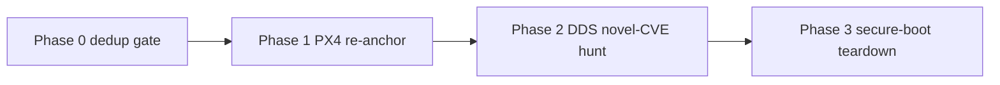

# Track 1 Run 4 — UAS / Autonomy Domain Run Plan

*PX4-anchored break/build, a dedup-clean re-anchor of the existing MAVLink capstone,
and a ROS 2 / DDS novel-CVE hunt on the autonomy-middleware layer.*

> **Status: PLAN (drafted 2026-09-19).** This is the sequenced plan for the next live
> Track 1 run, deliberately pivoting the domain from SOHO routers to UAS / autonomy to
> match the target market. Nothing here is executed yet; each phase names its own
> definition-of-done. Companion to [`track1-target-selection.md`](track1-target-selection.md)
> (which carried the router-era target rubric) and the role-alignment section of
> [`artifact-plan.md`](artifact-plan.md).

> **Scope & ethics (unchanged).** UNCLASSIFIED, open-source targets only — PX4,
> ArduPilot, ROS 2, and the DDS implementations are all public. Simulation-first
> (SITL); owned/bench hardware only for Phase 3. Coordinated disclosure; no committed
> firmware/binary blobs; personal COI / outside-activity reporting **before** any
> outbound disclosure. See [`disclosure-policy.md`](disclosure-policy.md).

---

## 1. Why this run, why now

The portfolio's **breadth** is done (all SSE competencies 1–8 + the systems-language
qual have an artifact) and the **credibility frontier** is unchanged: a genuinely *new*
CVE from a live run — no document substitutes for one real disclosure
([`NEXT-SESSION.md`](NEXT-SESSION.md)). Three router runs proved the method but all
deduped as n-days, and the DrayTek surface is now fully CVE'd, so the router path's
new-CVE upside has narrowed to a low-yield model fan-out.

This run answers "where does the next new-CVE attempt point?" with the domain that is
*simultaneously* the on-target market and a genuinely under-reviewed attack surface:
**UAS / autonomy**. The target employers are defense primes and defense startups
(Anduril class). The differentiator that a clearance line cannot show is **hands-on
depth in their actual problem domain** — embedded flight stacks and the autonomy
middleware that ties vehicles into a mesh — demonstrated as *break and build*, which is
the literal shape of a product-facing Systems Security Engineer role
([`artifact-plan.md`](artifact-plan.md) role-alignment section).

The existing UAS work ([capstone](track2/uas-capstone-assessment.md),
[threat model](track2/uas-autopilot-threat-model.md),
[hardening](track2/uas-mavlink-hardening.md), the
[Rust signing module](../tools/mavlink-signing/SPEC.md)) is a strong break/build core,
but it is ArduPilot-leaning and predates a key 2026 disclosure. This plan re-anchors it
to the defense-representative stack, makes it dedup-clean, and then extends it into the
surface where a novel CVE actually plausibly lives.

**The clock.** ~18 months to MS completion and SkillBridge. Target: land Phase 1
(fast, dedup-proof) and have **Phase 2 in flight before SkillBridge applications** — an
in-progress novel-CVE effort in the autonomy domain is the working-interview leverage
that converts a SkillBridge slot into an offer.

---

## 2. Target selection & rationale (rigor)

**PX4 is the spine; ArduPilot is the cross-stack validator.**

- **Licensing is the real driver.** PX4 is **BSD-3-Clause** — closed-source
  derivatives are allowed, which is what defense / dual-use integrators need (escrow
  code with authorities, keep IP private). ArduPilot is **GPLv3** — copyleft forces
  disclosure of modifications on distribution, which integrators avoid. This is *why*
  primes lean PX4 and why Auterion productizes PX4 (Skynode) for government/defense. It
  also makes the **build** artifact more credible on PX4: a BSD-3 hardening module is
  something a prime could actually adopt; a GPLv3 one they would not.
- **PX4 unifies all three phases.** It speaks MAVLink (Phase 1), it bridges to ROS 2
  via micro-XRCE-DDS (Phase 2), and it runs on Pixhawk-class hardware (Phase 3). One
  platform, one coherent arc.
- **ArduPilot is not abandoned.** Demonstrating the same weakness + mitigation on both
  stacks is a stronger "generalizes across both major open flight stacks" claim than
  single-stack, and it converts the existing ArduPilot work into a breadth signal.
  Note: ArduPilot RE-for-security is being actively published (see §10), so it is the
  *cross-validation* target, not the novelty bet.
- **Lattice reality check.** Anduril's Lattice is a proprietary, decentralized mesh
  C2 / autonomy platform — it cannot be targeted. Architecturally it is pub/sub
  autonomy middleware, which is exactly what **ROS 2 / DDS** is. So the DDS work in
  Phase 2 is not a fallback proxy; it is the closest open analog to Anduril's actual
  problem, and therefore the strongest domain-fluency signal available.

**Group 3+ framing.** Keep the plan's existing re-scope: interpret findings against the
class the market fields — BLOS/SATCOM C2, encrypted datalinks, GPS-denied / spoofing
resilience, the GCS as attack surface, multi-vehicle — even though SITL models a generic
airframe.

---

## 3. Phase 0 — Dedup gate & known-territory map (do this first)

> **Status: BUILT 2026-09-21** → [`../research/uas-autonomy/known-territory.md`](../research/uas-autonomy/known-territory.md).
> Sweep done (CVE-2026-1579 **verified**: PX4 v1.16.0 SITL, CVSS 9.8, CISA ICSA-26-090-02).
> **Headline finding:** the PX4 MAVLink surface (a 2026 CVE cluster) and Fast-DDS core
> RTPS/CDR parsing are **heavily mined** → cite, don't claim; the **micro-XRCE-DDS Agent is
> the thinnest-covered layer** (only 2 field-validation DoS CVEs) → the primary Phase 2
> novel-CVE aim, followed by the PX4↔uXRCE-DDS integration seam. Re-run the sweep before any
> candidate goes deep.

Three straight dedup outcomes make this the highest-ROI habit in the whole plan.
**Before any deep RE**, build a one-page known-territory map so effort aims only at
unclaimed surface. Sweep, at minimum:

- **NVD / CVE** and **GitHub Security Advisories** for: `PX4/PX4-Autopilot`,
  `ArduPilot/ardupilot`, `eProsima/Fast-DDS`, `eProsima/Micro-XRCE-DDS-Agent`,
  `eProsima/Fast-CDR`, `ros2` / `ros-security`.
- The **PX4** and **Dronecode** security policies / advisory processes.
- Recent academic + vendor disclosures (arXiv, Alias Robotics, ROS 2 security WG).

**Already-known (treat as demonstration, not novelty):**

- **CVE-2026-1579** — PX4 Autopilot: with MAVLink 2.0 signing disabled (the default),
  an unauthenticated party can send `SERIAL_CONTROL` (interactive shell) and other
  commands → arbitrary code execution. Affected **PX4 v1.16.0 SITL**; **CVSS v4.0 9.3 /
  v3.1 9.8**, CWE-306; mitigation is "enable MAVLink 2 signing per PX4 hardening docs."
  **This is the same class as the capstone's T1/T5 findings** — so Phase 1 cites it.
- MAVLink 2 signing weaknesses generally (optional/off-by-default, v1 downgrade, weak
  sequence handling, no payload encryption) — long-documented.
- ArduPilot control-aware RE security analysis — active academic work (§10).
- Historic DDS CVEs (2021: RTI Connext, OCI OpenDDS, eProsima Fast-DDS — DoS via
  crafted packets) and a 2025 batch of DDS middleware vulns.

**Deliverable:** `research/uas-autonomy/known-territory.md` (working-area paperwork;
blobs git-ignored per `.gitignore`). This is the gate every candidate finding in
Phases 1–2 passes through before deep time is spent.

---

## 4. Phase 1 — Re-anchor + dedup-clean the existing break/build (ships first)

> **Status: doc re-anchor DONE 2026-09-21; PX4 SITL measured run PENDING.** The
> **CVE-2026-1579 citation + severity anchor + PX4-primary/ArduPilot-cross-stack framing**
> are threaded through the [capstone](track2/uas-capstone-assessment.md),
> [threat model](track2/uas-autopilot-threat-model.md),
> [hardening writeup](track2/uas-mavlink-hardening.md), and [brief](track2/uas-security-brief.html)
> (the P6.2 module is framed as the MIT-licensed, adoptable build-side control). **Remaining
> break step (user-executed):** run `mavlink-sectest` against **PX4 SITL** (`make px4_sitl`)
> and record the stock FAIL cluster + signing-enabled clear as the primary demonstrated stack.

Low-cost because the work already exists; the point is to make it PX4-primary and
dedup-clean so it ships as a defensible artifact within weeks.

**Break (reproduction, explicitly cited — not claimed novel):**
- Run [`mavlink-sectest`](../tools/mavlink-sectest/README.md) against **PX4 SITL**
  (`make px4_sitl`) as the primary demonstrated stack; keep the ArduPilot run as the
  second data point → frame as **cross-stack**.
- Anchor the T1/T5 (signing/injection) results to **CVE-2026-1579** — cite it,
  reproduce it, and use its CVSS to anchor severity. This is currency + rigor, and it
  closes any implicit novelty read.

**Build (the differentiator):**
- Position the **P6.2 Rust MAVLink v2 signing module**
  ([`SPEC.md`](../tools/mavlink-signing/SPEC.md)) as the *remediation* — signing
  enforcement + downgrade refusal + anti-replay/timestamp window + key handling —
  adoptable because it is permissively licensed, mirroring PX4's BSD-3 posture.
- Optional stretch (from [`NEXT-SESSION.md`](NEXT-SESSION.md) Thrust A): make the
  module an **inline proxy** that enforces signing on the wire, proven end-to-end by
  the harness.

**Update for consistency (dedup hygiene):** add the CVE-2026-1579 citation and the
PX4-primary framing across [capstone](track2/uas-capstone-assessment.md),
[threat model](track2/uas-autopilot-threat-model.md), and
[brief](track2/uas-security-brief.html).

**DoD:** PX4 SITL run recorded (stock FAIL cluster + signing-enabled clear), CVE-2026-1579
cited and severity-anchored, ArduPilot retained as cross-stack, module framed as the
build-side control. **Dedup risk: zero** (citing, not claiming). **Competencies:**
embedded/IoT assessment (3), security architecture (1/4), Cyber T&E (7).

---

## 5. Phase 2 — CVE-upside flagship: ROS 2 / DDS + PX4 micro-XRCE-DDS bridge

> **Status: SCOPED 2026-09-21** → [`../research/uas-autonomy/phase2-micro-xrce-dds-scope.md`](../research/uas-autonomy/phase2-micro-xrce-dds-scope.md).
> Target locked to the **Micro-XRCE-DDS Agent** (Phase 0's thinnest layer). Surface mapped in
> 6 layers (transport framing → XRCE parse → Micro-CDR `ucdr` deserialize → entity XML/binary
> rep → session/stream state → PX4 integration seam) with 6 ranked hypotheses. **Priority: H1**
> (fuzz the `ucdr` parser — most likely clean CVE) **+ H5** (PX4 default bridge = no
> DDS-Security ⇒ unauthenticated command-topic surface, the CVE-2026-1579 pattern one layer up —
> highest impact). Next: acquire+build source (ASan/UBSan), stand up the fuzz + SITL rigs.

The genuinely new work, and the only surface here where a novel CVE is realistically on
the table. It is also the most Lattice-flavored layer (autonomy middleware / mesh).

**Attack surface (candidate-generating, all through the Phase 0 gate first):**
- **SROS2 / DDS-Security**: discovery and authentication handshakes, permissions/governance
  parsing, access-control policy edge cases.
- **micro-XRCE-DDS-Agent** (PX4's `uXRCE-DDS` bridge): privilege inheritance, discovery
  handling, the client↔agent trust boundary — a newer, less-audited surface than MAVLink.
- **DDS wire parsing** (Fast-DDS / Micro-XRCE / Fast-CDR): malformed-packet handling,
  RTPS submessage parsing — the classic memory-safety / DoS shape.

**Break → build symmetry:** each weakness maps to a build deliverable — a hardened SROS2
policy set, a locked-down bridge configuration, and detection guidance — so the artifact
is a product-security engineering piece, not just a bug.

**Disclosure path:** reuse the existing funnel — a confirmed finding flows
`finding.json` → [`finding-to-vendor-report`](../.claude/skills/finding-to-vendor-report/SKILL.md)
→ [`finding-to-cve-writeup`](../.claude/skills/finding-to-cve-writeup/SKILL.md) under
coordinated disclosure.

**DoD (value ships either way — the DrayTek ethos):** **either** a novel finding carried
into coordinated disclosure (CVE requested), **or** a rigorous negative result written up
as a security assessment of the middleware layer. **Competencies:** embedded/IoT
assessment (3), security architecture (1/4), Cyber T&E (7), Sw assurance (2).

---

## 6. Phase 3 — Hardware differentiator (cost-gated): flight-controller secure boot

Converts [`secure-boot-root-of-trust.md`](track2/secure-boot-root-of-trust.md) from
reference to demonstrated, and hits Anduril's build-hardware DNA specifically.

- **Target:** a Pixhawk-class flight controller (owned/bench).
- **Break:** UART/JTAG/SWD access, SPI-flash dump, bootloader analysis, secure-boot /
  signed-firmware chain (or its absence), glitch/fault-injection surface.
- **Build:** a signed-boot / chain-of-trust design mapped to the existing secure-boot doc.
- **Gate:** buy the board only once Phase 1 has shipped; this is the optional deepener,
  not a dependency. Overlaps [`NEXT-SESSION.md`](NEXT-SESSION.md) Thrust B (hardware).

**Competencies:** embedded HW / secure boot (6), anti-tamper (8), Cyber T&E (7).

---

## 7. Sequencing & timeline (job-market clock)

- **Phase 0** — now, days. Cheap, and it is the guard against a fourth dedup.
- **Phase 1** — weeks. First shippable, dedup-proof artifact. Do not gate anything on it
  beyond the re-anchor.
- **Phase 2** — the runway-consuming flagship; the real CVE ceiling lives here.
- **Phase 3** — optional, pre-SkillBridge, once budget/board allow.

Parallelize per the plan's cognitive-mode split
([`artifact-plan.md`](artifact-plan.md)): the **deep serial** flow is the Phase 2 DDS
reversing; the **parallel additive** work is the Phase 1 re-anchor edits, hardware
procurement, and brief updates. **Milestone:** Phase 1 done + Phase 2 in flight before
SkillBridge applications open.

---

## 8. Guardrails

- Open-source targets only (PX4/ArduPilot/ROS 2/DDS); no ITAR/EAR technical data.
- Simulation-first (SITL); Phase 3 hardware must be owned and on the bench.
- Coordinated disclosure for any finding; the funnel's sanitize linter gates publication.
- No firmware/binary blobs committed (`.gitignore`); record hashes, not binaries.
- Personal COI / outside-activity reporting precedes any outbound disclosure
  ([`disclosure-policy.md`](disclosure-policy.md) §5).
- SITL/RE want a real host — the cloud sandbox's network policy and missing extractors
  make these local-workstation tasks (see [`NEXT-SESSION.md`](NEXT-SESSION.md)).

---

## 9. Deliverables index (mirrors `artifact-plan.md` Phase 7)

| ID | Deliverable | Phase | Track |
|----|-------------|-------|-------|
| P7.1 | PX4 re-anchor + CVE-2026-1579 dedup pass across UAS artifacts | 1 | 1/2 |
| P7.2 | ROS 2 / DDS + micro-XRCE-DDS assessment & novel-CVE hunt | 2 | 1 |
| P7.3 | Flight-controller secure-boot teardown (cost-gated) | 3 | 1/2 |

Working area (paperwork committed, blobs git-ignored): `research/uas-autonomy/`.

---

## 10. Sources

- CVE-2026-1579 (PX4, MAVLink signing → SERIAL_CONTROL RCE): <https://app.opencve.io/cve/CVE-2026-1579>
- MAVLink 2 signing weaknesses (protocol): <https://groups.google.com/g/mavlink/c/V2YApLwUROw>
- PX4 vs ArduPilot licensing / defense adoption: <https://en.wikipedia.org/wiki/Auterion>
- RE & control-aware security analysis of ArduPilot (arXiv 2512.01164): <https://arxiv.org/pdf/2512.01164>
- ROS 2 / DDS middleware insecurity (Alias Robotics): <https://news.aliasrobotics.com/cybersecurity-in-the-ros-2-communication-middleware-targeting-the-top-6-dds-implementations/>
- "On the (In)Security of Secure ROS 2" (ACM CCS 2022): <https://dl.acm.org/doi/abs/10.1145/3548606.3560681>
- Anduril Lattice (Command & Control): <https://www.anduril.com/lattice/command-and-control>
