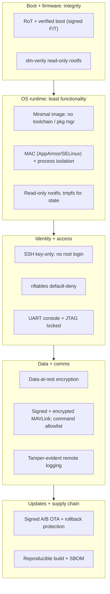

# Hardening Writeup — Linux UAS Companion Computer (real embedded target)

*End-to-end hardening of a real commercial embedded node: taking a Linux-based
UAS companion computer from as-shipped to defensible, realizing the mitigations
derived in the [UAS threat model](uas-autopilot-threat-model.md) and the secure-boot
chain from the [RoT explainer](secure-boot-root-of-trust.md), with every measure
mapped to **NIST SP 800-53 Rev.5** controls and **CMMC / NIST SP 800-171**
practices.*

> **Scope & clearance-safety.** UNCLASSIFIED. The target is a commercial ARM
> single-board computer (companion computer class) running an **open** build
> (Buildroot/Yocto + U-Boot + mainline Linux) so every step is reproducible and
> publishable. No proprietary, classified, or export-controlled data. Generic to
> any Linux embedded node; framed as the UAS companion computer (threat-model
> trust boundary TB2) for continuity.

## 1. Purpose & method

A threat model says what must be protected; a hardening writeup shows the system
actually providing it. This document walks the node from its as-shipped baseline
to a hardened state, layer by layer, and proves each control maps to a recognized
requirement. Method: **baseline the attack surface → apply threat-driven controls
(defense in depth) → map to 800-53 / CMMC → verify (Cyber T&E)**.

## 2. Baseline — the as-shipped attack surface

A typical vendor SBC image is optimized for developer convenience, not assurance:

- Default credentials; SSH password login enabled, root login permitted.
- A full userland: compilers, package manager, many enabled daemons.
- Writable root filesystem; no verified boot; bootloader console open on UART.
- Debug interfaces (UART console, sometimes JTAG) live.
- `mavlink-router` / networking exposed with no command filtering (threat-model
  **T7**: companion compromise → flight-critical command path).
- No data-at-rest encryption; local, editable logs.

This is the "before" the rest of the document removes.

## 3. Hardened architecture (defense in depth)

Each layer assumes the one outside it may be breached — the survivability posture
from the threat model, realized on a real node.

## 4. Hardening measures by layer

**L0 &mdash; Boot &amp; firmware integrity** (applies the RoT explainer; realizes T3)
- U-Boot **verified boot**: kernel+DTB in a signed FIT; public-key hash anchored
  in the SoC OTP; unsigned images refused.
- **dm-verity** read-only rootfs so on-disk tampering is detected on every read.
- Bootloader console disabled in production; boot order locked to internal media.

**L1 &mdash; Least functionality** (realizes T7; reduces blast radius)
- Minimal image built from Buildroot/Yocto: **no compiler, no package manager**,
  only the packages the mission needs.
- Read-only rootfs; writable state confined to `tmpfs` / a dedicated data
  partition.
- **Mandatory access control** (AppArmor or SELinux) confining `mavlink-router`,
  the flight app, and any network service; process isolation.

**L2 &mdash; Identity &amp; access** (realizes T7, T8-adjacent)
- Remove default accounts/creds; **SSH key-only**, `PermitRootLogin no`,
  non-default admin account.
- Host firewall (**nftables**) default-deny inbound; only the required ports open.
- **Debug lockdown**: serial console disabled, JTAG/SWD closed per the device
  lifecycle (RoT explainer §6).

**L3 &mdash; Data &amp; comms** (realizes T1, T4, T5, T10)
- **MAVLink v2 signing** enabled end-to-end (rejects unsigned/replayed commands);
  telemetry **encrypted** so mission data is not in plaintext on the RF link.
- `mavlink-router` restricted to an **allowlisted, rate-limited** command set from
  the companion to the flight controller.
- **Data-at-rest encryption** for mission data; keys in a TPM/secure element where
  present.
- **Tamper-evident logging** shipped to append-only/remote storage.

**L4 &mdash; Updates &amp; supply chain** (realizes T3, T9)
- **Signed A/B OTA** updates with anti-rollback; a bad update falls back safely.
- **Reproducible build** from pinned, verified sources; a generated **SBOM**;
  release artifacts signed in an HSM.

## 5. Controls mapping (NIST SP 800-53 Rev.5 &middot; CMMC / SP 800-171)

The center of the writeup: each measure traced to the threat it addresses and to
recognized control requirements.

| Hardening measure | Threat | NIST 800-53 r5 | CMMC / 800-171 | Verify |
|-------------------|:------:|----------------|----------------|--------|
| Verified boot (signed FIT) + dm-verity | T3 | SI-7, CM-14 | SI.L1-3.14.1; CM.L2-3.4.1 | Corrupt signed image &rarr; boot refuses |
| Minimal image, no toolchain/pkg mgr | T7 | CM-7 | CM.L2-3.4.6, 3.4.7 | Package audit; `gcc`/`apt` absent |
| MAC + process isolation | T7 | AC-6, SC-39 | AC.L2-3.1.5 | Confined proc denied out-of-policy action |
| SSH key-only, no root, no defaults | T7, T8 | AC-2, IA-2, IA-5 | AC.L1-3.1.1; IA.L1-3.5.1/2; IA.L2-3.5.3 | Password/root login attempt fails |
| nftables default-deny | T7 | SC-7, CM-7 | SC.L1-3.13.1; CM.L2-3.4.8 | Port scan: only required ports open |
| Debug/UART/JTAG lockdown | phys | CM-7, AC-3 | CM.L2-3.4.6 | Probe console/JTAG on prod unit &rarr; none |
| MAVLink v2 signing + anti-replay | T1, T5 | SC-8, IA-7 | SC.L2-3.13.8; IA.L2-3.5.10 | Inject unsigned/replayed cmd &rarr; rejected |
| Telemetry + data-at-rest encryption | T4 | SC-8, SC-13, SC-28 | SC.L2-3.13.8, 3.13.11, 3.13.16 | Capture link / image disk &rarr; no plaintext |
| mavlink-router command allowlist + rate-limit | T7 | AC-3, AC-6 | AC.L2-3.1.5; CM.L2-3.4.8 | Disallowed cmd from companion &rarr; blocked |
| Tamper-evident remote logging | T10 | AU-2, AU-9, AU-12 | AU.L2-3.3.1, 3.3.8 | Edit local log &rarr; detected upstream |
| Signed A/B OTA + rollback protection | T3 | SI-2, SI-7, CM-14 | SI.L1-3.14.1; CM.L2-3.4.2 | Unsigned/older update &rarr; refused |
| Reproducible build + SBOM + signed release | T9 | SR-3, SR-4, SR-11 | CM.L2-3.4.1; SI.L1-3.14.1 | Rebuild &rarr; identical hash; verify signature |

## 6. Attack-surface reduction (before &rarr; after)

| Dimension | As-shipped | Hardened |
|-----------|-----------|----------|
| Listening network services | many (SSH pw, mDNS, dev daemons, unfiltered MAVLink) | required only, behind default-deny firewall |
| Shell/toolchain on device | full (gcc, apt, scripting) | none (minimal image) |
| Root filesystem | writable | read-only + dm-verity |
| Authentication | default creds, SSH password, root login | key-only, no root, no defaults |
| Boot integrity | none | verified boot + rollback protection |
| Debug interfaces | UART console / JTAG open | locked per lifecycle state |
| Companion&rarr;FC command path | unrestricted | allowlisted + rate-limited + signed |
| Mission data / logs | plaintext, locally editable | encrypted at rest; tamper-evident remote logs |

## 7. Verification (Cyber T&E)

Each control has a negative test, runnable on the bench or in a lab:
- **Verified boot**: flip a byte in the signed FIT &rarr; U-Boot refuses to boot.
- **Surface**: `nmap` the hardened node &rarr; only intended ports; default-cred
  and root SSH attempts fail.
- **Least functionality**: confirm no compiler/package manager; MAC denies an
  out-of-policy action from a confined service.
- **Comms**: inject an unsigned and a replayed MAVLink command in SITL &rarr; both
  rejected; capture the link &rarr; no plaintext mission data.
- **Allowlist**: issue a disallowed command from the companion &rarr; blocked and
  logged.
- **Updates/supply chain**: apply an unsigned/older OTA &rarr; refused; reproduce
  the build &rarr; identical hash; verify the release signature and SBOM.
- A **CIS-benchmark-style audit** for regression tracking across builds.

## 8. Residual risk, trade-offs, assumptions

- **Residual (cyber-physical, not host-fixable):** RF jamming and GNSS spoofing
  are mitigated by failsafe behavior, not eliminated by hardening the node.
- **Trade-offs:** a read-only, toolchain-free image raises update and field-debug
  friction; MAC policies and signing add build/ops complexity. These are the cost
  of the assurance and are stated so the program can accept them knowingly.
- **Assumptions:** key management for signing/encryption is sound; physical
  security when not deployed; the flight controller enforces its own MAVLink
  signing (this node cannot compensate for an unauthenticated FC).

## 9. References

- **NIST SP 800-53 Rev.5** (control catalog); **NIST SP 800-171 Rev.2** &amp;
  **CMMC 2.0** (practices); **NIST SP 800-193** (firmware resiliency).
- CIS Benchmarks (Linux); Buildroot / Yocto, U-Boot verified boot, dm-verity,
  AppArmor/SELinux, nftables, MAVLink signing documentation.

---

### Qualifications this artifact demonstrates
- **Firmware / embedded security assessment &amp; hardening** on a real device (§§2-4).
- **Controls mapping to USG frameworks** &mdash; NIST 800-53 Rev.5 and CMMC / 800-171 (§5).
- **Secure boot &amp; key management applied** (L0/L3), realizing the RoT explainer.
- **Requirements-to-implementation traceability** &mdash; threat &rarr; control &rarr; verification.
- **Configuration management &amp; supply-chain assurance** (§4 L4, §5 SR/CM rows).
