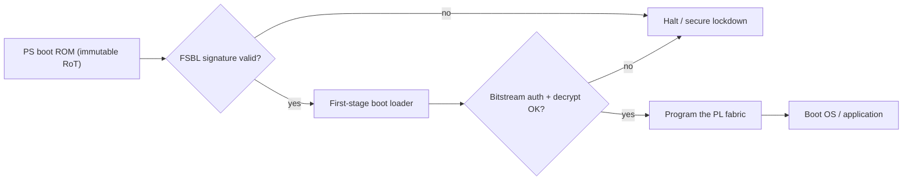

# FPGA Security Reference — extending the root of trust into programmable logic

*A reference explainer for securing SRAM-FPGA and SoC-FPGA designs: bitstream
authentication and encryption, key provisioning (eFUSE / BBRAM / PUF), side-channel and
anti-tamper exposure, and how the hardware root of trust extends into the programmable
fabric. It is the FPGA counterpart to the [secure-boot / root-of-trust
explainer](secure-boot-root-of-trust.md), and it closes the one **named** JD requirement
with no prior coverage (embedded HW **/ FPGA** secure boot, key management).*

> **Scope.** UNCLASSIFIED, vendor-neutral. Techniques are drawn from **publicly documented**
> features of common families (AMD/Xilinx 7-series & UltraScale+, Intel/Altera, Microchip
> PolarFire); no proprietary or export-controlled detail. Framed for the **Group 3+** class
> the target market fields, where FPGAs sit in radar/EW/SIGINT and sensor-/signal-processing
> payloads and frequently embody **Critical Program Information (CPI)** — which is why FPGA
> security and anti-tamper are inseparable.

## 1. Why FPGA security is its own problem
- **The bitstream *is* the design.** It carries the IP — and often CPI (algorithms realized
  in RTL). On volatile SRAM FPGAs it is loaded from external non-volatile memory at **every
  power-up**, so it is exposed in transit on the config bus and at rest in flash.
- **Reconfigurable and field-updatable** — the update channel is a first-class attack surface.
- A compromised bitstream runs **below the OS**, with direct control of I/O and actuators —
  there is no higher software layer to catch it.

## 2. Threats
| # | Threat | Consequence |
|---|--------|-------------|
| F1 | Bitstream cloning / theft (read from external flash) | IP / CPI loss; counterfeiting |
| F2 | Bitstream tampering / malicious logic (hardware trojan) | Altered function, hidden backdoor below the OS |
| F3 | Readback of the configured fabric | Design / embedded-key extraction |
| F4 | Key extraction via **side-channel** (DPA on the on-chip AES decryptor) | Defeats bitstream encryption |
| F5 | Fault / glitch injection at configuration time | Bypass of auth / decrypt checks |
| F6 | Supply chain (untrusted foundry, IP cores, EDA tools) | Implant beneath the bitstream, in silicon |
| F7 | Debug-port (JTAG) abuse | Readback, fabric control, key access |

## 3. The FPGA root of trust — secure configuration
Two controls, applied together, anchor the fabric:

- **Bitstream authentication (integrity + authenticity).** A keyed MAC (HMAC-SHA256) or a
  **public-key signature** (RSA-2048 / ECDSA) is verified *before* the fabric goes live —
  blocking F2. Public-key authentication is preferable: the verification (public) key can be
  fused without exposing a signing secret on the device.
- **Bitstream encryption (confidentiality).** **AES-256** — CBC-plus-HMAC on older families,
  authenticated **GCM** on newer ones — keeps the design/CPI opaque in flash and on the bus,
  blocking F1/F3. Prefer **authenticate-then-decrypt** (or an AEAD mode) so the device never
  processes unauthenticated data.

**SoC-FPGA secure boot chain.** On SoC-FPGAs (Zynq UltraScale+ MPSoC, Intel Agilex SoC,
Microchip PolarFire SoC) an immutable boot ROM in the processing system is the RoT: it
authenticates the first-stage boot loader, which authenticates (and decrypts) the PL
bitstream, which then releases the fabric and the OS — extending secure boot **into the PL**.

## 4. Key management — eFUSE vs BBRAM vs PUF
Where the AES/auth key lives is the crux, and each option is an anti-tamper trade-off:

- **eFUSE** — one-time-programmable, permanent, survives power loss. Durable and cheap, but
  it **cannot be zeroized**, so it is best for the *enforcement* fuses rather than a key you
  may need to wipe.
- **BBRAM** — battery-backed volatile key storage. It **can be actively zeroized** on tamper,
  which is exactly what an anti-tamper design wants — at the cost of a battery (a logistics
  and reliability consideration).
- **PUF-derived keys** — a Physically Unclonable Function derives a **device-unique** key from
  silicon manufacturing variation. Only *helper data* is stored, never the key, so there is
  nothing in NVM to read out — strong against cloning (F1) and extraction (F3/F4). Used as a
  key-encryption key that wraps the AES key, or as a root key (PolarFire SRAM-PUF;
  UltraScale+ PUF). PUFs need error correction for aging/temperature, and the helper data must
  be integrity-protected.

**Enforcement fuses (OTP), set once to lock the device down:** require-encrypted-bitstream,
require-authentication, **disable JTAG**, **disable readback**. **Provisioning lifecycle:**
generate keys in an HSM → program in a secure facility → burn the enforcement fuses → field.
It is irreversible — plan it deliberately.

## 5. Side-channel & anti-tamper
- **DPA is a demonstrated, real attack** against on-chip bitstream decryptors: differential
  power analysis of the AES engine has recovered bitstream keys on fielded families.
  Countermeasures: **DPA-resistant decryptor** cores, **per-block key rolling** (GCM), and
  limiting the number of decryptions with a given key.
- **Fault / glitch injection** (voltage or clock glitching to skip an auth check): mitigate
  with **redundant, temporally-separated** checks and glitch detectors.
- **Active / passive anti-tamper:** tamper mesh, voltage/temperature/light sensors that
  **zeroize the BBRAM key and erase the fabric** on tamper — the AT response that a CPI-bearing
  FPGA needs (ties to DoD AT, DoDI 5200.39, and the
  [milestone / anti-tamper approach](milestone-security-architecture-and-anti-tamper.md)).
- **Lock debug in production:** disable JTAG and configuration readback via eFUSE (F7).

## 6. Threat → requirement → control → T&E
| Threat | Requirement (SHALL) | Control | Verification (T&E) | Gate |
|--------|---------------------|---------|--------------------|------|
| F2 | The device SHALL authenticate the bitstream before configuration | RSA/ECDSA or HMAC bitstream auth | Load a byte-modified bitstream → refused | PDR/CDR |
| F1/F3 | The bitstream SHALL be encrypted at rest and on the config bus | AES-256 bitstream encryption | Dump flash / probe bus → ciphertext only | CDR |
| F4 | Key handling SHALL resist power side-channel | DPA-resistant decryptor / key rolling / PUF | Power-analysis eval → no key recovery in the trace budget | CDR/TRR |
| F5 | Configuration SHALL reject faulted/glitched loads | redundant auth checks + glitch detection | Voltage/clock glitch campaign → no auth bypass | TRR |
| F3/F7 | Config keys SHALL be device-unique and non-extractable | PUF-derived key; readback/JTAG disabled | Attempt readback / clone → fails | CDR/TRR |
| F6 | The build SHALL use trusted IP and reproducible tooling | trusted-foundry / IP provenance / reproducible synthesis | Provenance record + reproducible bitstream hash | PDR |

## 7. Residual risk & assumptions
- **Invasive attacks** (decapsulation, microprobing, FIB editing) can defeat most protections
  given enough time and budget — anti-tamper raises the cost and adds detection, it does not
  make compromise impossible.
- **Silicon-level supply-chain trojans** sit *below* the bitstream and are out of scope for
  configuration security; they are addressed by trusted foundry, split manufacturing, and
  logic locking (SCRM).
- **PUF reliability** (aging, temperature) depends on correct error correction and
  integrity-protected helper data.

## 8. References
- [Secure-boot / root-of-trust explainer](secure-boot-root-of-trust.md) — the RoT this extends.
- [Milestone security architecture + anti-tamper](milestone-security-architecture-and-anti-tamper.md)
  — the AT process (CPI → plan → AT&E) this feeds.
- NIST **SP 800-193** (platform firmware resiliency); AMD/Xilinx, Intel/Altera, and Microchip
  public FPGA security documentation.

---

### Competencies this artifact demonstrates
- **Security-relevant embedded HW / FPGA features** — secure boot, key management, anti-tamper
  (the named JD requirement, previously uncovered).
- **Requirements-from-threat + Cyber T&E** — §6 derives verifiable SHALLs with test methods.
- **Anti-tamper** — CPI-driven zeroization, DPA/fault resistance, tied to the DoD AT process.
