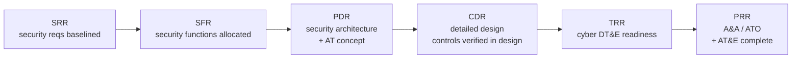
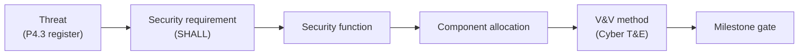
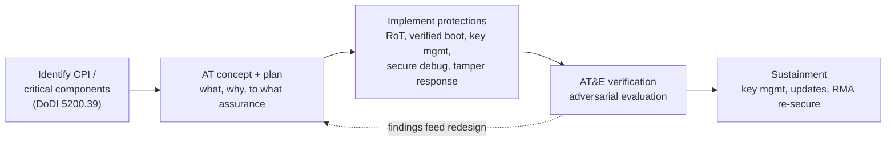

# Milestone Security Architecture & Anti-Tamper Approach — Open UAS Example System

*A lifecycle-structured security architecture for the open UAS example system,
showing what security engineering is produced and gated at each milestone review
(SRR &rarr; PRR), how requirements stay traceable through an MBSE model, and how an
anti-tamper approach is planned, implemented, and verified as a program discipline.
Synthesizes the [secure-boot/RoT explainer](secure-boot-root-of-trust.md), the
[threat model](uas-autopilot-threat-model.md), and the
[hardening writeup](embedded-hardening-writeup.md) into one architecture.*

> **Scope & clearance-safety.** UNCLASSIFIED. Built on the **open** ArduPilot/PX4 +
> MAVLink example and on **public policy references** only. Anti-tamper is treated
> as a *process and architecture* discipline: specific Critical Program Information
> (CPI), protection implementations, and AT levels are program-specific and would
> be classified &mdash; they are deliberately **not** included here. No proprietary,
> classified, or export-controlled (ITAR/EAR) technical data.

## 1. Purpose & method

A threat model and a hardening writeup show *what* to do; this document shows the
**engineering discipline that delivers it across the lifecycle** — the SSE view.
It (a) allocates security across the system architecture, (b) ties every control
to a requirement, a verification, and the milestone that gates it, (c) keeps that
traceable in an MBSE model, and (d) folds in anti-tamper, SCRM, software
assurance, and configuration management as program disciplines.

Frameworks: **NIST SP 800-160** (systems security engineering), **RMF (SP 800-37)**
with **JSIG / ICD 503** as the authorization overlay, **SP 800-161** (SCRM),
**Cyber Survivability** (CSAs), the **DoD Cyber T&E** process, and DoD anti-tamper
policy (**DoDI 5200.39** for CPI identification, **DoDD 5200.47E** for AT).

## 2. Lifecycle framing — security work gated at each milestone

Security is not a phase; it is produced continuously and *gated* at the systems
engineering technical reviews. Each gate has a security exit artifact.

| Milestone | Security engineering produced | Entry / exit gate |
|-----------|------------------------------|-------------------|
| **SRR** | Protection needs + security requirements baselined (from the threat model); loss/consequence analysis | Exit: requirements traced to threats and stakeholders |
| **SFR** | Security functions allocated to the functional architecture; trust boundaries defined | Exit: every requirement maps to a function |
| **PDR** | Preliminary **security architecture**; secure-boot/RoT concept; **anti-tamper concept** (CPI identified); SCRM approach | Exit: architecture shown to satisfy requirements; residual risk stated |
| **CDR** | Detailed security design; controls specified and shown correct in design; key-management design; AT protection design | Exit: design verified against requirements; test plans exist |
| **TRR** | Cyber DT&E readiness: attack-surface characterization, test cases, tooling, SITL environment | Exit: ready to execute cyber DT&E |
| **PRR** | Adversarial assessment + **AT&E** complete; RMF/JSIG **A&A** package; authorization (ATO) decision | Exit: authorized to produce/operate; residual risk accepted |

This table is the competency spine: it shows security requirements *decomposed and
traced across lifecycle gates*, not delivered as a one-time report.

## 3. Security architecture overview

The architecture synthesizes the three prior artifacts into allocated security
functions across the system's trust boundaries (defined in the threat model):

| Trust boundary | Security function | Realized by | Source doc |
|----------------|-------------------|-------------|-----------|
| RF links (TB1) | Command/telemetry authenticity + confidentiality | MAVLink v2 signing + encryption; anti-replay | Threat model T1/T4/T5 |
| Companion computer (TB2) | Least functionality + isolation + command mediation | Hardened Linux node; allowlist; MAC | Hardening writeup |
| Flight controller (TB3) | Boot & firmware integrity; key protection | Verified boot; OTP-anchored keys; anti-rollback | RoT explainer |
| Cross-cutting | Position integrity; survivable failsafe | Multi-sensor GNSS cross-check; defined recover states | Threat model T2/T6 |

## 4. Requirements traceability & MBSE

Every control is one link in a golden thread maintained in a single authoritative
**MBSE model** (SysML): requirements, functions, and components are model elements,
and the *satisfy / allocate / verify* relationships are model relationships — so a
change to a threat or requirement propagates through the model rather than through
scattered documents.

The model baseline is itself under configuration management (§7); each milestone
freezes a model baseline that the review is conducted against.

## 5. Anti-tamper approach (process)

Anti-tamper protects Critical Program Information from exploitation if an adversary
gains physical possession of the system. It is a **program process**, run in
parallel with the SE lifecycle, and it reuses the same RoT primitives from the
secure-boot explainer as its enforcement mechanisms.

- **Identify (SRR&ndash;PDR):** determine what, if compromised, gives an adversary an
  unacceptable advantage — the CPI and critical components (DoDI 5200.39).
- **Plan (PDR):** an AT concept stating what is protected, against whom, and to
  what assurance; this is the AT exit artifact at PDR.
- **Implement (CDR):** protections realized with the RoT primitives — verified
  boot, OTP-anchored keys, secure debug lockdown, tamper detection and
  **zeroization** (RoT explainer §6) — allocated to components.
- **Verify (TRR&ndash;PRR):** **AT&E** — adversarial evaluation that the protections
  hold to the planned assurance.
- **Sustain:** key management, field updates, and authenticated RMA re-securing.

> **Deliberate omission (clearance-safety).** Actual CPI, the specific protection
> implementations, and the AT assurance levels are program-specific and would be
> classified. This document establishes the *process and architecture* only; it
> names no protected technology.

## 6. Cyber Survivability

The architecture is a survivability argument, mapped to the Cyber Survivability
Attributes' prevent / mitigate / recover intent (from the threat model and
hardening writeup): **prevent** (authN/authZ, signed boot, encryption),
**mitigate** (least functionality, isolation, sensor cross-check), **recover**
(defined failsafes, tamper-evident logging, A/B rollback). AT adds a survivability
dimension for the *physically-captured* system: deny exploitation of CPI.

## 7. SCRM, Software Assurance & Configuration Management

Program disciplines threaded through every gate:

- **SCRM (SP 800-161):** provenance and component authenticity — reproducible,
  signed builds and an SBOM (hardening writeup L4); vetting of the open-source
  supply chain feeding the autopilot and companion images.
- **Software Assurance:** secure build pipeline plus the Track 3 tooling as
  standing SwA evidence — firmware triage, version-to-version diffing for
  silently-patched defects, and sink analysis, run each release.
- **Configuration Management:** version- and hash-controlled baselines for
  firmware, the hardened image, signing keys' public anchors, and the MBSE model;
  each milestone gates against a frozen baseline.

## 8. Verification, T&E & authorization

Cyber T&E is sequenced against the milestones: **characterize the attack surface**
and **cooperative vulnerability identification** feeding CDR/TRR, and an
**adversarial assessment** plus **AT&E** feeding PRR. The resulting evidence
populates the **RMF / JSIG / ICD 503** authorization package; the authorizing
official's ATO decision is the security exit criterion at PRR. Residual risk that
cannot be engineered out (RF jamming, probabilistic GNSS-spoof detection) is
documented and formally accepted, not hidden.

## 9. Residual risk, assumptions & scope

- **Residual:** cyber-physical effects (jamming, spoofing) are mitigated by
  survivable failsafe, not eliminated; AT raises the cost of exploitation, it does
  not make capture harmless.
- **Assumptions:** sound key management; a trusted authorizing official and
  operator; the MBSE model is the single source of truth and is kept current.
- **Out of scope:** classified CPI/AT specifics (by design); non-cyber safety
  engineering; any specific military platform.

## 10. References

- **NIST SP 800-160 Vol.1** (SSE); **SP 800-37** (RMF); **JSIG**, **ICD 503**
  (authorization overlays); **SP 800-161** (SCRM).
- DoD **Cyber Survivability** guidance (CSAs); DoD **Cyber T&E Guidebook**.
- DoD anti-tamper policy: **DoDI 5200.39** (CPI identification), **DoDD 5200.47E**
  (Anti-Tamper).
- Companion artifacts: RoT explainer, UAS threat model, hardening writeup (this repo).

---

### Qualifications this artifact demonstrates
- **Milestone-oriented security docs** &mdash; SRR/SFR/PDR/CDR/TRR/PRR gating (§§2,5,8).
- **MBSE integration** &mdash; requirements/functions/components/V&V as a traceable model (§4).
- **Anti-tamper process & documentation** &mdash; CPI &rarr; plan &rarr; implement &rarr; AT&E (§5).
- **SCRM, Software Assurance, Configuration Management** as program disciplines (§7).
- **Security architecture across the lifecycle** &mdash; requirements decomposed and traced (§§2-4).
- **USG methodology fluency** &mdash; 800-160/37/161, JSIG/ICD 503, Cyber Survivability, Cyber T&E, DoD AT policy.
