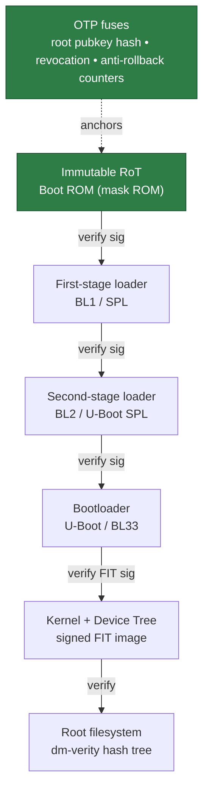
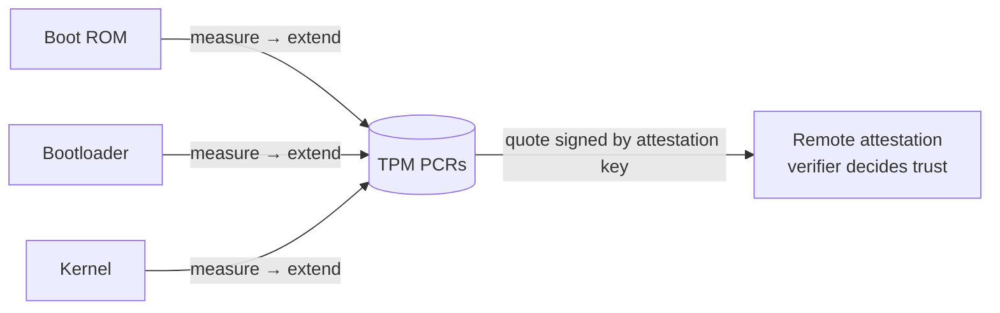
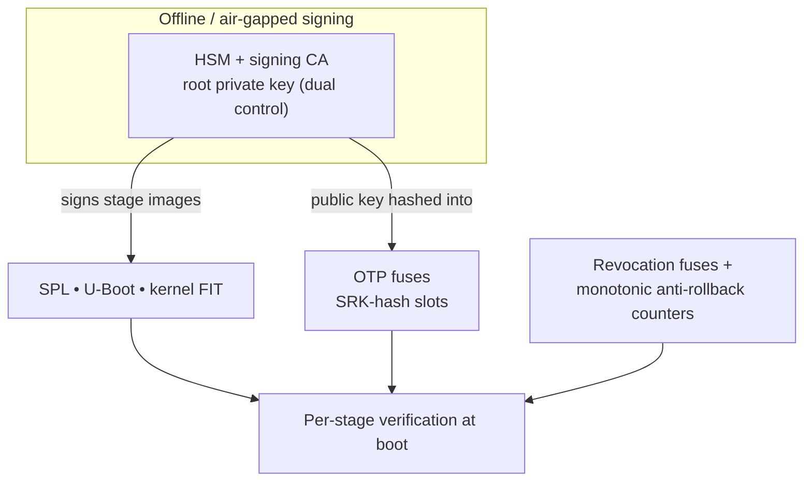
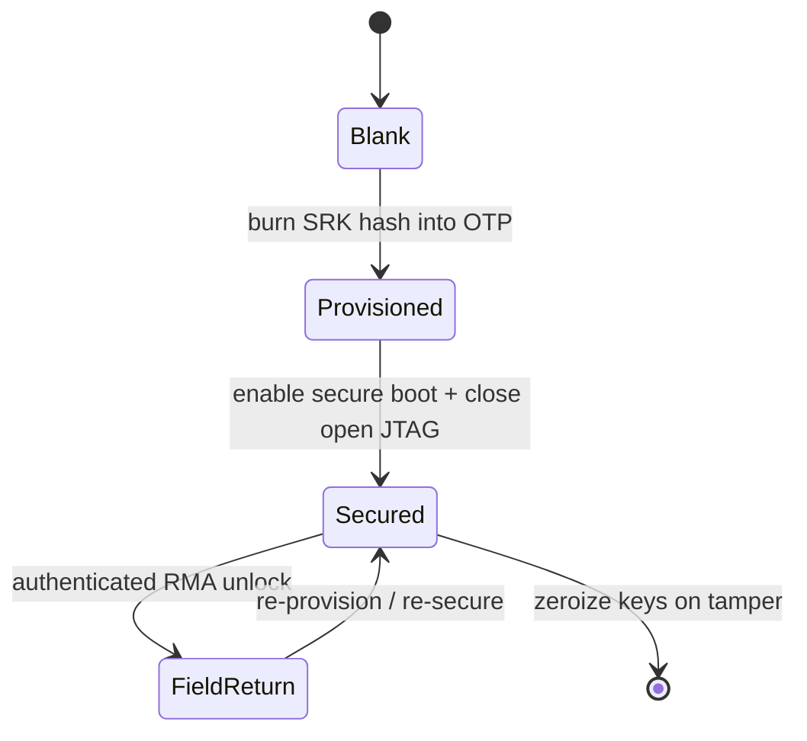

# Secure Boot & Hardware Root of Trust — a Reference Explainer

*A systems-security-engineering reference: how boot integrity is established on an
embedded platform, how it decomposes into verifiable requirements, and how it maps
to USG assurance vocabulary. Written for a technical and government audience.*

> **Scope & clearance-safety.** UNCLASSIFIED. Built entirely on **open, published**
> mechanisms — U-Boot verified boot, ARM Trusted Firmware-A (TF-A), the TCG TPM,
> and OpenTitan — and on public NIST guidance. It contains no vendor-proprietary,
> classified, or export-controlled (ITAR/EAR) technical data. Anti-tamper is
> discussed at the architecture/process level using public concepts only.

---

## 1. Why boot integrity is the foundation

Every security control above the bootloader — secure key storage, disk
encryption, authenticated services, remote attestation — assumes the code
enforcing it is the code the vendor shipped. If an attacker controls the **first
instruction that runs**, they control everything that trusts it. Boot integrity
is therefore the base of the assurance stack: it is what lets every higher layer
make a trust assumption at all.

The threats it counters are the ones that survive a reboot and defeat
software-only defenses:
- **Persistent firmware implants** (bootkit in the bootloader/flash).
- **Evil-maid / supply-chain tampering** (modified image flashed before delivery).
- **Downgrade attacks** (rolling back to a signed-but-vulnerable version).

## 2. Root of Trust — the anchor

A **Root of Trust (RoT)** is a component trusted *by axiom* because it cannot be
changed — trust has to start somewhere that is not itself verified. On most SoCs
this is an **immutable Boot ROM (mask ROM)** fixed at fabrication, plus **one-time-
programmable (OTP) fuses** that hold the anchor secret (typically the *hash* of
the root signing public key, not the key itself).

The RoT provides one or more trust functions (TCG / NIST SP 800-193 framing):

| RoT function | Role |
|--------------|------|
| RoT for **Verification** (RTV) | Cryptographically verifies the next stage before executing it (secure boot) |
| RoT for **Measurement** (RTM) | Measures (hashes) each stage and records it (measured boot) |
| RoT for **Storage** (RTS) | Protects secrets/measurements from modification (e.g., TPM, secure element) |
| RoT for **Reporting** (RTR) | Signs measurements for remote attestation |

NIST **SP 800-193** (Platform Firmware Resiliency) frames the goals as
**Protect / Detect / Recover**; **SP 800-147** (firmware update protection) and
**SP 800-155** (firmware measurement) fill in the update and measurement details.
These are the vocabulary an SSE writes requirements in.

## 3. Chain of trust — verified (secure) boot

Because ROM space is tiny, the RoT does not verify everything; it verifies the
**next** stage, which verifies the **next**, and so on. Each link
**verifies-before-execute**, and a failed verification **halts** the boot. Break
any link and everything downstream is untrusted.

Concrete open implementations of this exact shape:
- **ARM TF-A:** `BL1` (in ROM) → `BL2` → `BL31` (secure monitor) → `BL33`
  (U-Boot), each stage authenticating the next via the Trusted Board Boot chain.
- **U-Boot verified boot:** kernel + DTB packaged in a signed **FIT image**;
  U-Boot verifies the RSA/ECDSA signature against a public key whose hash is
  anchored in the ROM/OTP before booting.
- **Linux `dm-verity`:** the read-only rootfs is backed by a Merkle hash tree
  whose root hash is passed (signed) from the verified kernel command line, so
  filesystem tampering is detected on every block read.

## 4. Secure boot vs. measured boot

These are different goals and are often used **together**.

| | **Secure (verified) boot** | **Measured boot** |
|---|---|---|
| Mechanism | Verify signature, **halt on failure** | Hash each stage, **extend a PCR**, keep booting |
| Decision point | Local, at boot time | Remote, via attestation of the PCR quote |
| Answers | "Is this stage authorized to run?" | "What exactly ran?" |
| Needs | Root pubkey in OTP | TPM / secure element with PCRs + attestation key |
| Failure mode | Boot stops | Boot continues; verifier withholds trust/access |

Verified boot **enforces** locally; measured boot **proves** to a remote party
what booted. A resilient design does both: refuse to run unauthorized code, *and*
be able to attest what did run.

## 5. Key management

Secure boot is only as strong as the key hierarchy behind it.

The load-bearing practices:
- **Private key never on the device.** Signing happens offline in an **HSM**
  under dual control; only signatures and public-key *hashes* reach the product.
- **Anchor is a hash.** OTP stores the hash of the root public key (small, and it
  lets the full key live in the image), verified by ROM before use.
- **Anti-rollback.** A monotonic version counter (in fuses/secure storage) refuses
  images older than the last-accepted version, defeating downgrade-to-vulnerable.
- **Revocation.** Multiple key slots plus revocation fuses allow retiring a
  compromised signing key in the field without bricking the anchor.
- **Separation.** Distinct keys per stage/role limit the blast radius of any one
  key compromise.

## 6. Device lifecycle & the anti-tamper link

The RoT is also the anchor for **anti-tamper (AT)**: it is where key material
lives and where tamper response is enforced. Devices move through **fuse-defined
lifecycle states**, and secure debug is gated by them.

Architecture-level AT concepts the RoT enables (all public):
- **Tamper-resistant key storage** — keys in OTP/secure element, not readable by
  software; **zeroization** of secrets on a tamper event.
- **Secure debug** — JTAG/SWD disabled in the Secured state, or unlockable only
  with an authenticated challenge tied to the RoT.
- **Passive vs active AT** — passive: make extraction hard (epoxy, buried traces,
  disabled debug); active: sensors that trigger zeroization on intrusion.
- **Lifecycle enforcement** — a device that has left "Secured" cannot silently
  return to trusted operation without re-provisioning.

*(DoD anti-tamper as a program discipline protects Critical Program Information;
this section stays at the unclassified architecture level and deliberately omits
any protected-technology specifics.)*

## 7. Attacking the chain (threat decomposition)

The point of understanding the mechanism is knowing how it fails. Each row is a
real, publicly-documented attack class against secure-boot implementations.

| # | Attack | Where in the chain | Mitigation |
|---|--------|--------------------|------------|
| 1 | **Rollback / downgrade** to a signed-but-vulnerable version | Any verified stage | Monotonic anti-rollback counters in fuses |
| 2 | **Signing-key compromise** (leak/theft) | Whole chain | HSM + dual control; key revocation slots |
| 3 | **Unverified link** — unsigned DTB, U-Boot env, splash, or recovery/USB boot path | Gaps between verified stages | Verify *everything* executed or trusted, including config and recovery |
| 4 | **TOCTOU** — verify one buffer, execute another | Verify→execute boundary | Verify in place; lock/measure exactly what executes |
| 5 | **Fault injection** (voltage/clock/EM glitch) to skip the "verify failed" branch | The signature-check branch | Redundant checks, glitch/voltage sensors, control-flow integrity, random delays |
| 6 | **Debug port left open** (JTAG/UART/console) | Post-boot foothold | Lifecycle-gated debug lockdown; authenticated unlock only |
| 7 | **Non-secure "verified" flag** — trust bit in writable storage | State handling | Keep trust decisions in registers/fuses, never in mutable RAM/flash |
| 8 | **Unauthenticated update / peripheral firmware** (Wi-Fi, baseband, coprocessor) | Outside the main chain | Sign and verify *all* updatable firmware, not just the AP image |

Rows 3 and 8 are where real embedded products most often fail: the main image is
signed, but a device-tree, an environment variable, a recovery mode, or a
coprocessor blob is not — and that unverified link is the way in.

## 8. From mechanism to security requirements (the SSE move)

An SSE does not just describe secure boot — they **decompose it into verifiable
requirements** and trace each to a threat and a verification method, gated at the
right milestone review.

| Threat (§7) | Derived requirement | Verification (T&E) | Milestone |
|-------------|---------------------|--------------------|-----------|
| Unauthorized code (1,3,7) | Every executed stage SHALL be signature-verified against an OTP-anchored key before execution | Flip one bit in a signed image → device SHALL halt | PDR / CDR |
| Downgrade (1) | Boot SHALL reject images below the stored anti-rollback version | Attempt to boot version N-1 after N → rejected | CDR / TRR |
| Key compromise (2) | Signing keys SHALL reside only in an HSM; a revoked key SHALL NOT verify | Revoke a key slot → images signed by it fail | PDR |
| Fault injection (5) | The verify decision SHALL survive a single-glitch fault | Glitch campaign against the check branch | TRR / T&E |
| Open debug (6) | Debug interfaces SHALL be disabled in the Secured lifecycle state | Probe JTAG on a Secured unit → no access | TRR |

This is the connective tissue to the USG vocabulary: **NIST SP 800-160** (build
trustworthiness in, requirements engineering), **SP 800-193/147/155** (firmware
resiliency, update, measurement), and the **Cyber T&E** discipline (each control
has a negative test that proves it). Boot-integrity evidence also feeds Cyber
Survivability (prevent/mitigate/recover) arguments.

## 9. Verification & test checklist

Concrete tests an assessor runs — the boot-integrity slice of a T&E plan:
- **Negative signature test:** corrupt one byte of each signed stage → each SHALL halt.
- **Rollback test:** attempt an older signed version → rejected by the counter.
- **Revocation test:** sign with a revoked key → fails verification.
- **Coverage audit:** enumerate everything executed/trusted (DTB, env, splash,
  recovery, peripheral firmware) and confirm each is verified — hunt for row-3/8 gaps.
- **Debug audit:** probe JTAG/UART/console on a production-lifecycle unit.
- **Glitch resilience:** fault-injection campaign against the verify branch.
- **Measured-boot validation:** confirm PCRs match a known-good and that a
  modified stage changes the quote.

## 10. References (open sources)

- NIST **SP 800-193** Platform Firmware Resiliency; **SP 800-147** BIOS Protection;
  **SP 800-155** BIOS Integrity Measurement; **SP 800-160 Vol. 1** Systems Security
  Engineering.
- TCG **TPM 2.0** Library Specification (PCRs, measured boot, attestation).
- **ARM Trusted Firmware-A** Trusted Board Boot documentation.
- **U-Boot** verified boot / FIT signature documentation.
- **OpenTitan** — open-source silicon root-of-trust design documentation.
- Linux **dm-verity** documentation.

---

### Qualifications this artifact demonstrates
- **Embedded HW security features — secure boot, key management, anti-tamper**
  (§§2–6): the core of this explainer.
- **Deriving/decomposing security requirements from threats** (§§7–8).
- **USG methodology fluency** (§§2, 8): NIST SP 800-193/147/155/160, TCG, Cyber T&E.
- **Milestone-oriented engineering** (§8): requirements gated at PDR/CDR/TRR.
- **Briefing complex concepts visually** (§§3–6 diagrams; §§7–9 tables).
