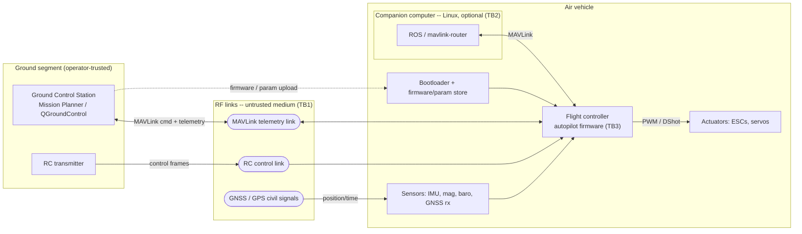
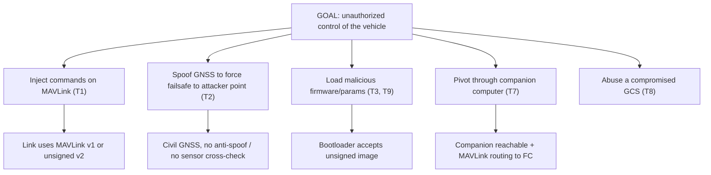

# Threat Model — Open UAS Autopilot Platform (ArduPilot / PX4 + MAVLink)

*A systems-security-engineering threat model of an open, cyber-physical embedded
platform. It characterizes the system, enumerates threats, assesses risk, and
**derives verifiable security requirements from those threats** — the core
requirements-from-threat-intel task — in NIST SP 800-160 language.*

> **Scope & clearance-safety.** UNCLASSIFIED. The subject is the **open-source**
> ArduPilot / PX4 autopilot stack and the public MAVLink protocol — chosen so the
> analysis is fully publishable. It models a generic hobby/commercial airframe.
> It contains no proprietary, classified, or export-controlled (ITAR/EAR)
> technical data, and no specific military platform. Testing is described only in
> **simulation (SITL)** or on owned hardware.

## 1. Purpose, method, and framing

**Purpose.** Establish, before design hardening, what can go wrong with an open
UAS autopilot and what security the system therefore *must* provide. This model
is also the analytical foundation for the hands-on capstone assessment (P5.1).

**Method (declared).** A data-centric threat model per **NIST SP 800-154**,
enumerated with **STRIDE**, risk-assessed per **NIST SP 800-30** (threat source →
threat event → vulnerability → likelihood × impact → risk), with mitigations
mapped to **Cyber Survivability** (Prevent / Mitigate / Recover) and to **MITRE
ATT&CK for ICS**. Requirements are expressed in **NIST SP 800-160 Vol. 1**
terms: stakeholder protection needs → system security requirements → verification,
traced to milestone reviews.

## 2. System characterization (800-154 step 1)

The autopilot is a real-time flight controller (MCU-class: e.g. STM32H7 running
ChibiOS on ArduPilot or NuttX on PX4) that fuses sensor data and drives actuators,
linked by RF to a ground segment and, optionally, to an onboard Linux companion
computer.

**Trust boundaries.** TB1: every RF link crosses open air — no physical control
of the medium. TB2: the companion computer is a general-purpose networked host of
very different assurance than the flight MCU. TB3: the flight controller is the
safety-critical core; code and parameters there are life-of-flight authority.

**Key design facts that drive the threats.** MAVLink v1 has **no authentication**;
MAVLink v2 supports per-message **signing (HMAC-SHA256)** but it is frequently left
disabled — realized as **CVE-2026-1579** (PX4 v1.16.0: signing off ⇒ unauthenticated
`SERIAL_CONTROL` shell ⇒ RCE, **CVSS 9.8**, CWE-306, CISA ICSA-26-090-02, 2026-03-31).
Civil **GNSS is unauthenticated** and spoofable with commodity SDR. The
**bootloader accepts firmware/parameters** over USB/serial; signed-firmware support
exists but is often not enabled on non-defense hardware.

## 3. Assets, protection needs, and loss scenarios (800-160)

| Asset | Protection need | Loss scenario (consequence) |
|-------|-----------------|-----------------------------|
| Control authority over the vehicle | **Integrity, availability** | Hijack / fly-away / forced crash — safety event |
| Position & time solution (GNSS) | **Integrity** | Vehicle flown to attacker-chosen location; failsafe abused |
| Autopilot firmware & parameters | **Integrity** | Persistent implant; altered failsafe/geofence behavior |
| Mission plan & telemetry | **Confidentiality** | Operation, route, payload activity disclosed |
| Availability of the link | **Availability** | Loss of C2; forced failsafe/RTL/land |
| Signing / binding keys (if present) | **Confidentiality** | Whole authentication scheme defeated |

Safety of flight (control integrity) is the top-priority loss; a UAS is a
cyber-physical system where a security failure is a safety failure.

## 4. Threat sources (800-30)

| Source | Capability | Intent |
|--------|-----------|--------|
| Nation-state / advanced | High (SDR, GNSS sim, firmware RE, supply chain) | Hijack, surveillance, denial |
| Criminal / activist | Moderate (off-the-shelf SDR, open tooling) | Theft, disruption, trespass defeat |
| Hobbyist / researcher | Low–moderate | Curiosity, mischief |
| Insider (operator/maintainer) | Physical + credential access | Sabotage, data theft |
| Environmental | n/a | Unintentional RF interference (models availability) |

## 5. Threat enumeration (STRIDE, mapped to ATT&CK for ICS)

| # | Threat event | STRIDE | Boundary | ATT&CK for ICS |
|---|--------------|--------|----------|----------------|
| T1 | Inject/override commands on an unauthenticated MAVLink link | **T**ampering / **E**oP | TB1 | T0855 Unauthorized Command Message |
| T2 | GNSS spoofing to falsify position/time → drive failsafe/RTL | **S**poofing / **T** | TB1 | T0856 Spoof Reporting Message (sensor) |
| T3 | Upload unsigned firmware/params via bootloader | **T** / EoP | TB3 | T0857 System Firmware |
| T4 | Eavesdrop mission plan & telemetry | **I**nfo disclosure | TB1 | T0842 Network Sniffing |
| T5 | Replay captured telemetry/command frames | **S** / **T** | TB1 | T0830 Adversary-in-the-Middle |
| T6 | Jam RC or telemetry link | **D**oS | TB1 | T0814 Denial of Service |
| T7 | Compromise companion computer (Linux/ROS/network) | EoP / **T** | TB2 | T0858 Change Operating Mode |
| T8 | Compromise GCS operator station | **S** / **T** | ground | T0855 (via trusted GCS) |
| T9 | Supply-chain tamper of firmware build/dependencies | **T** | TB3 | T0862 Supply Chain Compromise |
| T10 | Tamper with onboard logs/params to hide actions | **R**epudiation | TB3 | T0872 (evade) |

## 6. Risk assessment (800-30)

Risk = likelihood × impact, scored qualitatively (0–10) with rationale recorded in
the threat register. The register, ranked:

The high-risk cluster is consistent and instructive: the top three
(**GNSS spoofing, MAVLink command injection, unsigned firmware upload**) are all
*missing-authentication* failures on an interface the design treats as trusted but
the physics does not. That is the theme the requirements below attack.

## 7. Attack tree — top loss scenario

Goal: **adversary gains unauthorized control of the vehicle.** (OR-decomposition;
each leaf is a threat event from §5.)

## 8. Security requirements derived from threats (800-160 — the core)

For each significant threat, a stakeholder protection need becomes a verifiable
**system security requirement**, traced to a control type, a verification method,
and the milestone at which it is gated. This is the requirements-from-threat
decomposition.

| Threat | Protection need | Derived requirement (SHALL) | Control | Verification (T&E) | Gate |
|--------|-----------------|-----------------------------|---------|--------------------|------|
| T1 | Command integrity | The autopilot SHALL reject MAVLink command messages lacking a valid v2 signature | Prevent | SITL: inject unsigned CMD → rejected | PDR/CDR |
| T2 | Position integrity | The system SHALL detect GNSS spoofing via multi-sensor consistency (IMU/baro/flow) and enter a safe, defined state | Detect + Recover | HIL/SITL GNSS-sim spoof → anomaly flagged, safe state | CDR/TRR |
| T3 | Firmware integrity | The bootloader SHALL verify a signature over firmware and parameters before execution | Prevent | Flip a byte in a signed image → refused | PDR/CDR |
| T4 | Telemetry confidentiality | Telemetry carrying mission data SHALL be encrypted end-to-end | Prevent | Capture link → no plaintext mission data | CDR |
| T5 | Anti-replay | Signed messages SHALL include a monotonic timestamp; stale/replayed frames rejected | Prevent | Replay captured frames → rejected | CDR |
| T6 | Availability | On link loss the vehicle SHALL execute a pre-defined, operator-set failsafe (RTL/land/hold) | Mitigate + Recover | Kill link in SITL → correct failsafe | TRR |
| T7 | Segmentation | The companion computer SHALL NOT be able to issue flight-critical commands beyond an allowlisted, rate-limited set | Prevent | Attempt disallowed cmd from companion → blocked | CDR |
| T9 | Supply-chain assurance | Firmware SHALL be built reproducibly from pinned, verified sources and signed in an HSM | Prevent | Reproduce build → identical hash; verify signature | PDR |
| T10 | Non-repudiation | The autopilot SHALL log commands and mode changes to tamper-evident storage | Detect | Attempt log edit → detectable | TRR |

## 9. Cyber Survivability mapping (Prevent / Mitigate / Recover)

- **Prevent:** MAVLink v2 signing (T1/T5), signed firmware (T3), telemetry
  encryption (T4), companion-computer command allowlist (T7), reproducible+signed
  builds (T9).
- **Mitigate:** multi-sensor GNSS cross-check (T2), rate-limiting and geofence
  bounds, least-privilege companion interface.
- **Recover:** defined failsafe behaviors on link loss or spoof detection (T2/T6),
  return-to-launch, and tamper-evident logging for post-incident reconstruction
  (T10).

A survivable design assumes some controls will be defeated and still degrades
safely — the recover column is why a UAS threat model is a survivability argument,
not just a prevention checklist.

## 10. Verification & test (Cyber T&E)

The derived requirements are testable **without a real aircraft**, which keeps
the work open and safe:
- **SITL (software-in-the-loop)** for ArduPilot/PX4: inject unsigned/replayed
  MAVLink, kill the link, drive failsafe logic — all in simulation.
- **GNSS spoofing** against a bench receiver with a signal simulator (owned lab
  only), or modeled in SITL sensor injection.
- **Signed-firmware negative test**: corrupt a signed image → bootloader refuses.
- **MAVLink fuzzing** of the parser on the target build.
- **Reproducible-build check** for the supply-chain requirement.

## 11. Residual risk & assumptions

- **Assumed:** physical security of the vehicle when not deployed; a trusted
  operator; correct key management if signing/encryption is enabled.
- **Residual:** RF jamming (T6) cannot be prevented, only mitigated by failsafe;
  GNSS spoofing detection is probabilistic, not absolute; a fully-compromised GCS
  (T8) operating within its authority is largely out of band for the autopilot.
- **Out of scope:** the airframe's non-cyber failure modes; specific military
  platforms; anything not reproducible on the open stack.

## 12. References

- NIST **SP 800-160 Vol. 1** (systems security engineering); **SP 800-154**
  (data-centric threat modeling); **SP 800-30** (risk assessment).
- **MITRE ATT&CK for ICS** (technique IDs above).
- DoD **Cyber Survivability** guidance (Prevent / Mitigate / Recover).
- **MAVLink** message-signing documentation; **ArduPilot** / **PX4** security &
  SITL documentation.

---

### Qualifications this artifact demonstrates
- **Deriving & decomposing security requirements from threats** (§§5–8) — the core.
- **Firmware / IoT / embedded security assessment** (§§2, 5) on a defense-relevant class.
- **USG methodology fluency** — NIST SP 800-160 / 800-154 / 800-30, Cyber
  Survivability, ATT&CK for ICS (throughout).
- **Milestone-oriented engineering** (§8 requirements gated at PDR/CDR/TRR).
- **Cyber T&E** (§10) and **briefing visuals** (§§2, 6, 7).
