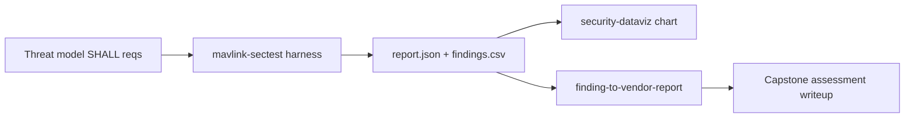

# UAS Autopilot Capstone Assessment (P5.1) — MAVLink Cyber T&E

*The hands-on execution of the [UAS autopilot threat model](uas-autopilot-threat-model.md):
its derived SHALL requirements are run as automated test-and-evaluation against an
ArduPilot/PX4 software-in-the-loop (SITL) target, and the results are scored, charted,
and (on any failure) written up through the disclosure funnel. This is the "show"
artifact that turns the threat model from analysis into measured result.*

> **Status: SITL run complete (2026-09-18).** Executed against ArduPilot ArduCopter
> SITL over `tcp:127.0.0.1:5760`. The §5 results are **measured** (from `report.json` /
> `findings.csv`, archived under [`assets/`](assets/)); the signing-enabled before/after
> re-run is the next step (§6). Non-MAVLink-link requirements (T2/T3/T7/T9/T10) remain
> out-of-harness follow-on.

> **Scope, safety & clearance.** UNCLASSIFIED, open-source stack (ArduPilot/PX4 + public
> MAVLink). **Simulation-first** — the harness targets SITL on localhost and sends only a
> benign, non-actuating `REQUEST_MESSAGE`; it never arms, changes mode, or writes
> parameters. Pointing it at real hardware needs `--allow-nonsim` **and** an owned vehicle
> on the bench with props off, per [`docs/disclosure-policy.md`](../disclosure-policy.md).
> No proprietary/classified/ITAR data.

## 1. Objective & framing

Execute, as Cyber T&E, the verifiable requirements derived in the threat model (§8) and
report whether an open autopilot build actually enforces them. Per the plan's Group 3+
re-scope, the findings are interpreted against the class the target market fields —
**BLOS/SATCOM C2, encrypted datalinks, GPS-denied/spoofing resilience, the GCS as an
attack surface, multi-vehicle** — even though the SITL lab models a generic airframe.
The assessment is structured by the threat model and gated the way the
[milestone architecture doc](milestone-security-architecture-and-anti-tamper.md) frames
PDR/CDR/TRR.

## 2. System under test

| Item | Value |
|------|-------|
| Autopilot stack | ArduPilot **ArduCopter SITL** (heartbeat: system 1) |
| Simulator | ArduPilot `sim_vehicle.py -v ArduCopter -w --no-mavproxy` |
| MAVLink version | v2 (frames observed **unsigned**) |
| Endpoint | `tcp:127.0.0.1:5760` (SITL native port) |
| Harness | `tools/mavlink-sectest/mavlink_sectest.py` (`--selftest` green) |
| Signing configured? | **No** — 11/11 observed frames unsigned (drives the T1/T5 result) |
| Run date | 2026-09-18 |

## 3. Method



Each harness check emits **PASS / FAIL / INFO** against a mapped requirement.
`findings.csv` (columns `finding,risk,severity`) is charted by the
[`security-dataviz`](../../.claude/skills/security-dataviz/SKILL.md) skill; any FAIL feeds
the [`finding-to-vendor-report`](../../.claude/skills/finding-to-vendor-report/SKILL.md)
skill via a `finding.json`.

## 4. Test matrix (threat → requirement → test → expected)

Automated by the harness (covers the MAVLink-link requirements of threat model §8):

| Test | Threat | Requirement (SHALL) | Verification | Expected on stock SITL | Gate |
|------|:------:|---------------------|--------------|------------------------|------|
| `signing` | T1/T5 | Reject MAVLink command messages lacking a valid v2 signature | Observe whether frames are signed / unsigned accepted | **FAIL** (signing off by default) | PDR/CDR |
| `cmd_injection` | T1 | An unsigned command SHALL NOT be accepted | Send benign unsigned `REQUEST_MESSAGE`; observe response | **FAIL** (accepted) | PDR/CDR |
| `replay` | T5 | Stale/replayed signed frames SHALL be rejected | Replay a captured frame; observe re-acceptance | **FAIL/INFO** (no anti-replay without signing) | CDR |
| `telemetry` | T4 | Mission telemetry SHALL be encrypted end-to-end | Inspect link for cleartext mission data | **FAIL** (cleartext) | CDR |
| `failsafe` | T6 | On link loss, execute an operator-set failsafe | Non-intrusive read of failsafe parameter | **PASS/INFO** (usually configured) | TRR |

A stock, unhardened SITL is *expected* to fail the authentication-family checks — that is
the finding: the open default leaves T1/T4/T5 unmet, exactly the missing-authentication
theme the threat model's high-risk cluster predicts. The assessment's value is measuring
and framing that gap against the SHALL set, not "discovering" that SITL is insecure.

**Not covered by this harness** (assessed by other methods; out of this run's scope):
T2 GNSS spoofing (signal sim / SITL sensor injection), T3 signed-firmware negative test
(bootloader), T7 companion-computer segmentation, T9 reproducible-build/supply-chain,
T10 tamper-evident logging. Tracked as follow-on T&E in the threat model §10.

## 5. Results — measured 2026-09-18 (stock SITL)

Verbatim from `report.json` (archived: [`assets/uas-capstone-report.json`](assets/uas-capstone-report.json),
[`assets/uas-capstone-findings.csv`](assets/uas-capstone-findings.csv)).

| Test | Result | Observation | Risk (0–10) | Severity | SHALL met? |
|------|:------:|-------------|:-----------:|:--------:|:----------:|
| `signing` | **FAIL** | 11/11 frames unsigned (MAVLink v2 signing off) | 8.5 | High | ✗ |
| `cmd_injection` | **FAIL** | unsigned command **ACCEPTED** (benign `REQUEST_MESSAGE`) | 8.5 | High | ✗ |
| `replay` | **FAIL** | identical replayed frame accepted again (no anti-replay) | 5.5 | Medium | ✗ |
| `telemetry` | INFO | no telemetry decoded in this config — not decisively tested | 6.0 | undet. | undet. |
| `failsafe` | **PASS** | link-loss failsafe configured (`FS_THR_ENABLE=1.0`) | 7.0 | — | ✓ |

**3 FAIL · 1 PASS · 1 INFO.**


## 6. Analysis & findings

**The stock open build fails the entire missing-authentication cluster — exactly the
threat model's top-ranked risk.** T1 (command integrity) is unmet on two independent
checks — frames are unsigned (`signing`) and an unsigned command was accepted
(`cmd_injection`) — and T5 anti-replay fails as a direct consequence (no signature ⇒ no
monotonic timestamp to reject a replay). This realizes ATT&CK-ICS **T0855 Unauthorized
Command Message** across trust boundary **TB1**: any actor on the RF medium can inject or
replay commands to the flight controller. Risk 8.5 (High) reflects the cyber-physical
loss — control-authority compromise is a safety event, the model's top loss scenario.

- `replay` scores Medium (5.5), not High: impact depends on the semantics of the
  replayable frame, and it is subsumed once signing (with timestamps) is enabled.
- `telemetry` (T4) is **INFO, not a pass** — this config (`--no-mavproxy`, no stream
  requested) emitted no telemetry to inspect, so cleartext could not be *demonstrated*
  this run. The requirement stands (MAVLink telemetry is unencrypted by default); to
  decide it, request data streams (`SET_MESSAGE_INTERVAL` / `REQUEST_DATA_STREAM`) or run
  with MAVProxy streaming, then capture. Tracked as a re-run item.
- `failsafe` (T6) is the one satisfied SHALL — `FS_THR_ENABLE=1.0` — because it is a
  *safety* default, not a security control.

**Gate readiness:** T1/T5 are **blocking at PDR/CDR**; T4 undetermined (re-test); T6 clears
its TRR check. Remediation follows the survivability §9 Prevent column: enable **MAVLink v2
signing** (closes `signing` + `cmd_injection`, and supplies the timestamp that closes
`replay`) plus a link-layer encryption/tunnel for T4.

### Next step — before/after (prove the control closes the gap)
Re-run with signing enabled on the link and record the delta:

| Test | Now (stock) | Expected with signing |
|------|:-----------:|:---------------------:|
| `signing` | FAIL | PASS |
| `cmd_injection` | FAIL | PASS |
| `replay` | FAIL | PASS (timestamped) |

That before/after is the difference between *finding* the gap and *proving the fix* — the
SSE-level result. Implementing the signing control itself is the **P6.2** systems-language
build (a MAVLink v2 signing module — [build spec](../../tools/mavlink-signing/SPEC.md)),
which this assessment then re-tests.

## 7. Reproduction

```bash
pip install -r tools/mavlink-sectest/requirements.txt        # pymavlink
# Bring up a simulator that publishes MAVLink on udp:127.0.0.1:14550, then:
python3 tools/mavlink-sectest/mavlink_sectest.py --connect udp:127.0.0.1:14550 \
    --out report.json --csv findings.csv
# Verify the harness itself anytime (no SITL needed):
python3 tools/mavlink-sectest/mavlink_sectest.py --selftest
```

SITL setup and the end-to-end path are in [`docs/NEXT-SESSION.md`](../NEXT-SESSION.md)
Path B; the harness contract is in
[`tools/mavlink-sectest/README.md`](../../tools/mavlink-sectest/README.md).

## 8. Competencies demonstrated

- **Firmware/IoT/embedded assessment** on a defense-relevant cyber-physical class (hands-on).
- **Cyber T&E** — requirements-as-tests, benign/simulation-first, reproducible.
- **Requirements traceability** — threat → SHALL → test → finding → gate, tied to the
  threat model and milestone architecture.
- **Briefing** — findings charted and reported through the disclosure funnel.
