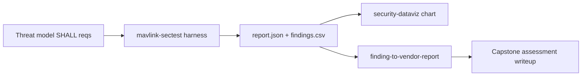

# UAS Autopilot Capstone Assessment (P5.1) — MAVLink Cyber T&E

*The hands-on execution of the [UAS autopilot threat model](uas-autopilot-threat-model.md):
its derived SHALL requirements are run as automated test-and-evaluation against an
ArduPilot/PX4 software-in-the-loop (SITL) target, and the results are scored, charted,
and (on any failure) written up through the disclosure funnel. This is the "show"
artifact that turns the threat model from analysis into measured result.*

> **Status: SITL run + signing before/after complete (2026-09-18).** Executed against
> ArduPilot ArduCopter SITL. §5 records both the stock run (**4 FAIL**) and the
> signing-enabled re-run; §6 adds a deterministic in-repo proof via the **P6.2** signing
> module (7/7 `cargo test`, pymavlink interop). All five MAVLink-link checks are now decisive;
> non-MAVLink-link requirements (T2/T3/T7/T9/T10) are out-of-harness follow-on.

> **Phase 1 re-anchor (2026-09-21) — PX4-primary + CVE-2026-1579, both stacks measured.** Per
> the [Run 4 plan](../track1-uas-run-plan.md), the flight-stack posture is now **PX4-primary**
> (PX4 is BSD-3 → defense-integrable; ArduPilot GPLv3 is the cross-stack validator). **PX4 SITL
> has now been run** (§5.1) and reproduces the **identical 4 FAIL / 1 PASS** cluster ArduPilot
> showed — cross-stack confirmation. The T1/T5 (`signing`/`cmd_injection`) findings are the
> **same weakness class as CVE-2026-1579** — PX4 v1.16.0, MAVLink signing off ⇒ unauthenticated
> `SERIAL_CONTROL` shell ⇒ RCE, **CVSS 9.8**, CWE-306
> ([CISA ICSA-26-090-02](https://www.cisa.gov/news-events/ics-advisories/icsa-26-090-02), 2026-03-31).
> This assessment **cites and reproduces** that public CVE; it does **not** claim the finding
> as novel. Dedup basis: [`known-territory.md`](../../research/uas-autonomy/known-territory.md).

> **Scope, safety & clearance.** UNCLASSIFIED, open-source stack (ArduPilot/PX4 + public
> MAVLink). **Simulation-first** — the harness targets SITL on localhost and sends only a
> benign, non-actuating `REQUEST_MESSAGE`; it never arms, changes mode, or writes
> parameters. Pointing it at real hardware needs `--allow-nonsim` **and** an owned vehicle
> on the bench with props off, per [`docs/disclosure-policy.md`](../disclosure-policy.md).
> No proprietary/classified/ITAR data.

## 1. Objective & framing

Execute, as Cyber T&E, the verifiable requirements derived in the threat model (§8) and
report whether an open autopilot build actually enforces them. Per the plan's Group 3+
re-scope, the findings are interpreted against the class the target market fields —
**BLOS/SATCOM C2, encrypted datalinks, GPS-denied/spoofing resilience, the GCS as an
attack surface, multi-vehicle** — even though the SITL lab models a generic airframe.
The assessment is structured by the threat model and gated the way the
[milestone architecture doc](milestone-security-architecture-and-anti-tamper.md) frames
PDR/CDR/TRR.

## 2. System under test

| Item | Value |
|------|-------|
| Autopilot stack | ArduPilot **ArduCopter SITL** (heartbeat: system 1) |
| Simulator | ArduPilot `sim_vehicle.py -v ArduCopter -w --no-mavproxy` |
| MAVLink version | v2 (frames observed **unsigned**) |
| Endpoint | `tcp:127.0.0.1:5760` (SITL native port) |
| Harness | `tools/mavlink-sectest/mavlink_sectest.py` (`--selftest` green) |
| Signing configured? | **No** — 11/11 observed frames unsigned (drives the T1/T5 result) |
| Run date | 2026-09-18 |

**Stack posture (Phase 1 re-anchor).** PX4 is the **primary** target stack going forward
(BSD-3 licensing → a hardening/signing artifact a prime could actually adopt); the run in
this table is the **ArduPilot** data point, and **PX4 SITL has now been measured** too
(**§5.1** — PX4 v1.18.0-beta1, `make px4_sitl gz_x500`, MAVLink on `udp:127.0.0.1:14550`).
The threat model and harness are stack-agnostic (both speak MAVLink v2), so the SHALL set and
the checks transfer unchanged — which the identical result across both stacks confirms.

## 3. Method



Each harness check emits **PASS / FAIL / INFO** against a mapped requirement.
`findings.csv` (columns `finding,risk,severity`) is charted by the
[`security-dataviz`](../../.claude/skills/security-dataviz/SKILL.md) skill; any FAIL feeds
the [`finding-to-vendor-report`](../../.claude/skills/finding-to-vendor-report/SKILL.md)
skill via a `finding.json`.

## 4. Test matrix (threat → requirement → test → expected)

Automated by the harness (covers the MAVLink-link requirements of threat model §8):

| Test | Threat | Requirement (SHALL) | Verification | Expected on stock SITL | Gate |
|------|:------:|---------------------|--------------|------------------------|------|
| `signing` | T1/T5 | Reject MAVLink command messages lacking a valid v2 signature | Observe whether frames are signed / unsigned accepted | **FAIL** (signing off by default) | PDR/CDR |
| `cmd_injection` | T1 | An unsigned command SHALL NOT be accepted | Send benign unsigned `REQUEST_MESSAGE`; observe response | **FAIL** (accepted) | PDR/CDR |
| `replay` | T5 | Stale/replayed signed frames SHALL be rejected | Replay a captured frame; observe re-acceptance | **FAIL/INFO** (no anti-replay without signing) | CDR |
| `telemetry` | T4 | Mission telemetry SHALL be encrypted end-to-end | Inspect link for cleartext mission data | **FAIL** (cleartext) | CDR |
| `failsafe` | T6 | On link loss, execute an operator-set failsafe | Non-intrusive read of failsafe parameter | **PASS/INFO** (usually configured) | TRR |

A stock, unhardened SITL is *expected* to fail the authentication-family checks — that is
the finding: the open default leaves T1/T4/T5 unmet, exactly the missing-authentication
theme the threat model's high-risk cluster predicts. The assessment's value is measuring
and framing that gap against the SHALL set, not "discovering" that SITL is insecure.

**Not covered by this harness** (assessed by other methods; out of this run's scope):
T2 GNSS spoofing (signal sim / SITL sensor injection — **now planned** in
[`uas-gnss-spoofing-test-plan.md`](uas-gnss-spoofing-test-plan.md), pending its own SITL run),
T3 signed-firmware negative test
(bootloader), T7 companion-computer segmentation, T9 reproducible-build/supply-chain,
T10 tamper-evident logging. Tracked as follow-on T&E in the threat model §10.

## 5. Results — measured 2026-09-18 (stock SITL)

Verbatim from `report.json` (archived: [`assets/uas-capstone-report.json`](assets/uas-capstone-report.json),
[`assets/uas-capstone-findings.csv`](assets/uas-capstone-findings.csv)).

| Test | Result | Observation | Risk (0–10) | Severity | SHALL met? |
|------|:------:|-------------|:-----------:|:--------:|:----------:|
| `signing` | **FAIL** | 216/216 frames unsigned (MAVLink v2 signing off) | 8.5 | High | ✗ |
| `cmd_injection` | **FAIL** | unsigned command **ACCEPTED** (benign `REQUEST_MESSAGE`) | 8.5 | High | ✗ |
| `replay` | **FAIL** | identical replayed frame accepted again (no anti-replay) | 5.5 | Medium | ✗ |
| `telemetry` | **FAIL** | cleartext telemetry decoded — `ATTITUDE`, `GLOBAL_POSITION_INT`, `GPS_RAW_INT`, `VFR_HUD`, `BATTERY_STATUS` | 6.0 | Medium | ✗ |
| `failsafe` | **PASS** | link-loss failsafe configured (`FS_THR_ENABLE=1.0`) | 7.0 | — | ✓ |

**4 FAIL · 1 PASS · 0 INFO** — four of the five requirements unmet on the stock link.


### After — MAVLink v2 signing enabled (same SITL, `signing setup` in MAVProxy)

Re-run with signing enabled on the link (initial signing-on run archived at
[`assets/uas-capstone-report-signed.json`](assets/uas-capstone-report-signed.json) — it
predates the `telemetry`/`failsafe` harness fixes; the table below reflects the current harness):

| Test | Before (stock) | After (signing on) | What it shows |
|------|:--------------:|:------------------:|--------|
| `signing` | FAIL (0 signed) | **PASS** (all frames signed) | T1/T5 authenticity enforced |
| `cmd_injection` | FAIL (accepted) | **INFO** — no `COMMAND_ACK` | unsigned command dropped |
| `replay` | FAIL (accepted) | **INFO** — not re-accepted | replayed frame dropped |
| `telemetry` | FAIL (cleartext) | **INFO** — stream request dropped | can't pull a stream once unauthenticated |
| `failsafe` | PASS | **INFO** — param read dropped | can't read params once unauthenticated |

Enabling signing flips `signing` to **PASS** and shuts the attacks out. The instructive part:
*every* active check the harness drives (commands, stream/param requests) goes **INFO** on the
signed link — the harness is now an **unauthenticated peer**, and the hardened vehicle
correctly rejects its unsigned probes. That is the security property working, but it means the
SITL after-run can't *positively* confirm the control by itself. The deterministic proof is the
**P6.2** module (§6): unsigned → reject, signed → valid, replayed → reject.

> *Methodology note: this stock run also validated two harness fixes — the `telemetry` (T4)
> check now decodes a requested stream (cleartext confirmed), and the `failsafe` check reports
> the correct parameter (`FS_THR_ENABLE`, not a stray streamed `PARAM_VALUE`). Both landed in
> `mavlink_sectest.py` before this run.*

### 5.1 PX4 cross-stack run — measured 2026-09-21 (the primary stack)

Re-run against **PX4 SITL** to make PX4 the primary demonstrated stack (Phase 1). Setup: **PX4
v1.18.0-beta1**, `make px4_sitl gz_x500` (Gazebo Jetty / `gz-transport15`) on Ubuntu 26.04 WSL;
harness → `udp:127.0.0.1:14550` (MAVLink instance #0, the GCS link; heartbeat from system 1).
Archived: [`assets/uas-capstone-report-px4.json`](assets/uas-capstone-report-px4.json),
[`assets/uas-capstone-findings-px4.csv`](assets/uas-capstone-findings-px4.csv).

| Test | Result | Observation | SHALL met? |
|------|:------:|-------------|:----------:|
| `signing` | **FAIL** | 1885/1885 frames unsigned (PX4 MAVLink v2 signing off by default) | ✗ |
| `cmd_injection` | **FAIL** | unsigned command **ACCEPTED** | ✗ |
| `replay` | **FAIL** | identical replayed frame accepted again | ✗ |
| `telemetry` | **FAIL** | cleartext `ATTITUDE`, `GLOBAL_POSITION_INT`, `GPS_RAW_INT`, `VFR_HUD`, `BATTERY_STATUS` | ✗ |
| `failsafe` | **PASS** | `NAV_RCL_ACT=2` (RC-loss action = *Return*) | ✓ |

**4 FAIL · 1 PASS — identical to ArduPilot (§5).** This is the cross-stack confirmation: the
missing-authentication default is a property of the open MAVLink ecosystem, not one vendor. And
the `signing` FAIL + `cmd_injection` **ACCEPTED** pair **is CVE-2026-1579 measured on PX4** — the
exact unauthenticated-command defect (signing off ⇒ unsigned commands accepted) that CVE scores
9.8, reproduced (not claimed).

> *Methodology note (PX4 int params): PX4 returns integer-typed params (e.g. `NAV_RCL_ACT`) by
> packing the raw bytes into MAVLink's float field, so the first run surfaced the value as a raw
> `2.802596928649634e-45` — the byte pattern `0x00000002` = int `2`. The verdict was correct
> throughout (non-zero ⇒ configured ⇒ PASS); only the display was wrong. The harness now decodes
> PX4 int-typed params (`decode_param_value`, covered by `--selftest`), so it reports
> `NAV_RCL_ACT=2`. ArduPilot types its params `REAL32`, so its floats are untouched.*

## 6. Analysis & findings

**The stock open build fails the entire missing-authentication cluster — exactly the
threat model's top-ranked risk.** T1 (command integrity) is unmet on two independent
checks — frames are unsigned (`signing`) and an unsigned command was accepted
(`cmd_injection`) — and T5 anti-replay fails as a direct consequence (no signature ⇒ no
monotonic timestamp to reject a replay). This realizes ATT&CK-ICS **T0855 Unauthorized
Command Message** across trust boundary **TB1**: any actor on the RF medium can inject or
replay commands to the flight controller. Risk 8.5 (High) reflects the cyber-physical
loss — control-authority compromise is a safety event, the model's top loss scenario.
This is the **same weakness class as CVE-2026-1579** (PX4 v1.16.0: MAVLink signing off ⇒
unauthenticated `SERIAL_CONTROL` shell ⇒ RCE; **CVSS 9.8**, CWE-306, CISA ICSA-26-090-02,
2026-03-31): the harness measures on the open stack exactly the missing-authentication
defect that CVE scores at near-maximum severity. The finding is **cited and reproduced,
not claimed novel** ([dedup basis](../../research/uas-autonomy/known-territory.md)).

- `replay` scores Medium (5.5), not High: impact depends on the semantics of the
  replayable frame, and it is subsumed once signing (with timestamps) is enabled.
- `telemetry` (T4) is **FAIL** — with a stream requested, the harness decoded five cleartext
  telemetry types (`ATTITUDE`, `GLOBAL_POSITION_INT`, `GPS_RAW_INT`, `VFR_HUD`,
  `BATTERY_STATUS`). MAVLink telemetry is unencrypted by default and signing does not encrypt
  it, so mission data (position, battery, attitude) is disclosed to any passive listener on TB1.
- `failsafe` (T6) is the one satisfied SHALL — `FS_THR_ENABLE=1.0` — because it is a
  *safety* default, not a security control.

**Gate readiness:** T1/T4/T5 are **blocking at PDR/CDR**; T6 clears its TRR check. Remediation follows the survivability §9 Prevent column: enable **MAVLink v2
signing** (closes `signing` + `cmd_injection`, and supplies the timestamp that closes
`replay`) plus a link-layer encryption/tunnel for T4. Full remediation guide — techniques,
key management, and verification per finding: [`uas-mavlink-hardening.md`](uas-mavlink-hardening.md).

### Before/after — the control closes the gap (measured)
Two independent demonstrations:

**(1) On the live link** — enabling MAVLink v2 signing in SITL flipped the cluster
(§5 "After"): `signing` FAIL→PASS, `cmd_injection`/`replay` FAIL→INFO (attacks no longer
succeed), **0 FAIL**.

**(2) Deterministically, in-repo** — the **P6.2** MAVLink v2 signing module
([`tools/mavlink-signing/`](../../tools/mavlink-signing/SPEC.md), 7/7 `cargo test` green,
cross-checked byte-for-byte against a pymavlink-signed frame) proves the control's behavior:

| Input | P6.2 verdict |
|-------|:------------:|
| unsigned frame | `Unsigned` (reject) |
| correctly signed | `Valid` |
| tampered payload | `BadSignature` |
| replayed (ts ≤ last) | `Replay` |

Together these are the SSE-level result: the gap was found *and* the fix is proven — on the
live link and in a memory-safe implementation we control (no `unsafe`, zero external deps).

## 7. Reproduction

```bash
pip install -r tools/mavlink-sectest/requirements.txt        # pymavlink
# Bring up a simulator that publishes MAVLink on udp:127.0.0.1:14550, then:
python3 tools/mavlink-sectest/mavlink_sectest.py --connect udp:127.0.0.1:14550 \
    --out report.json --csv findings.csv
# Verify the harness itself anytime (no SITL needed):
python3 tools/mavlink-sectest/mavlink_sectest.py --selftest
```

SITL setup and the end-to-end path are in [`docs/NEXT-SESSION.md`](../NEXT-SESSION.md)
Path B; the harness contract is in
[`tools/mavlink-sectest/README.md`](../../tools/mavlink-sectest/README.md).

## 8. Competencies demonstrated

- **Firmware/IoT/embedded assessment** on a defense-relevant cyber-physical class (hands-on).
- **Cyber T&E** — requirements-as-tests, benign/simulation-first, reproducible.
- **Requirements traceability** — threat → SHALL → test → finding → gate, tied to the
  threat model and milestone architecture.
- **Briefing** — findings charted and reported through the disclosure funnel.
