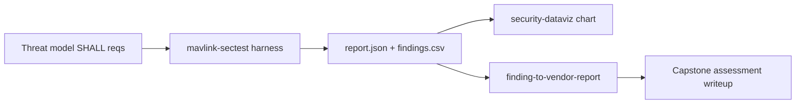

# UAS Autopilot Capstone Assessment (P5.1) — MAVLink Cyber T&E

*The hands-on execution of the [UAS autopilot threat model](uas-autopilot-threat-model.md):
its derived SHALL requirements are run as automated test-and-evaluation against an
ArduPilot/PX4 software-in-the-loop (SITL) target, and the results are scored, charted,
and (on any failure) written up through the disclosure funnel. This is the "show"
artifact that turns the threat model from analysis into measured result.*

> **Status: harness built + verified; SITL run pending.** The T&E instrument
> (`tools/mavlink-sectest`) passes its self-test and the analytical structure below is
> complete. The **Results** section (§5) is a template to be filled from a real SITL run
> on an unrestricted host — see [Reproduction](#7-reproduction). Nothing here is fabricated:
> result cells read *pending* until measured.

> **Scope, safety & clearance.** UNCLASSIFIED, open-source stack (ArduPilot/PX4 + public
> MAVLink). **Simulation-first** — the harness targets SITL on localhost and sends only a
> benign, non-actuating `REQUEST_MESSAGE`; it never arms, changes mode, or writes
> parameters. Pointing it at real hardware needs `--allow-nonsim` **and** an owned vehicle
> on the bench with props off, per [`docs/disclosure-policy.md`](../disclosure-policy.md).
> No proprietary/classified/ITAR data.

## 1. Objective & framing

Execute, as Cyber T&E, the verifiable requirements derived in the threat model (§8) and
report whether an open autopilot build actually enforces them. Per the plan's Group 3+
re-scope, the findings are interpreted against the class the target market fields —
**BLOS/SATCOM C2, encrypted datalinks, GPS-denied/spoofing resilience, the GCS as an
attack surface, multi-vehicle** — even though the SITL lab models a generic airframe.
The assessment is structured by the threat model and gated the way the
[milestone architecture doc](milestone-security-architecture-and-anti-tamper.md) frames
PDR/CDR/TRR.

## 2. System under test

| Item | Value (fill at run time) |
|------|--------------------------|
| Autopilot stack / version | *pending* (e.g. ArduCopter 4.x SITL / PX4 1.15 SITL) |
| Simulator | *pending* (ArduPilot `sim_vehicle.py` / PX4 `jmavsim`) |
| MAVLink dialect / version | *pending* (v2 expected) |
| Endpoint | `udp:127.0.0.1:14550` (default) |
| Harness | `tools/mavlink-sectest/mavlink_sectest.py` (`--selftest` green) |
| Signing configured? | *pending* (stock SITL: **no** — drives the expected T1/T5 result) |

## 3. Method



Each harness check emits **PASS / FAIL / INFO** against a mapped requirement.
`findings.csv` (columns `finding,risk,severity`) is charted by the
[`security-dataviz`](../../.claude/skills/security-dataviz/SKILL.md) skill; any FAIL feeds
the [`finding-to-vendor-report`](../../.claude/skills/finding-to-vendor-report/SKILL.md)
skill via a `finding.json`.

## 4. Test matrix (threat → requirement → test → expected)

Automated by the harness (covers the MAVLink-link requirements of threat model §8):

| Test | Threat | Requirement (SHALL) | Verification | Expected on stock SITL | Gate |
|------|:------:|---------------------|--------------|------------------------|------|
| `signing` | T1/T5 | Reject MAVLink command messages lacking a valid v2 signature | Observe whether frames are signed / unsigned accepted | **FAIL** (signing off by default) | PDR/CDR |
| `cmd_injection` | T1 | An unsigned command SHALL NOT be accepted | Send benign unsigned `REQUEST_MESSAGE`; observe response | **FAIL** (accepted) | PDR/CDR |
| `replay` | T5 | Stale/replayed signed frames SHALL be rejected | Replay a captured frame; observe re-acceptance | **FAIL/INFO** (no anti-replay without signing) | CDR |
| `telemetry` | T4 | Mission telemetry SHALL be encrypted end-to-end | Inspect link for cleartext mission data | **FAIL** (cleartext) | CDR |
| `failsafe` | T6 | On link loss, execute an operator-set failsafe | Non-intrusive read of failsafe parameter | **PASS/INFO** (usually configured) | TRR |

A stock, unhardened SITL is *expected* to fail the authentication-family checks — that is
the finding: the open default leaves T1/T4/T5 unmet, exactly the missing-authentication
theme the threat model's high-risk cluster predicts. The assessment's value is measuring
and framing that gap against the SHALL set, not "discovering" that SITL is insecure.

**Not covered by this harness** (assessed by other methods; out of this run's scope):
T2 GNSS spoofing (signal sim / SITL sensor injection), T3 signed-firmware negative test
(bootloader), T7 companion-computer segmentation, T9 reproducible-build/supply-chain,
T10 tamper-evident logging. Tracked as follow-on T&E in the threat model §10.

## 5. Results — PENDING SITL RUN

Fill from `report.json` / `findings.csv`. Do not populate from expectation — only from a run.

| Test | Result (PASS/FAIL/INFO) | Observation | Risk (0–10) | Severity | Requirement met? |
|------|:-----------------------:|-------------|:-----------:|:--------:|:----------------:|
| `signing` | *pending* | | | | |
| `cmd_injection` | *pending* | | | | |
| `replay` | *pending* | | | | |
| `telemetry` | *pending* | | | | |
| `failsafe` | *pending* | | | | |

*Chart (fill after run):* `findings-by-severity.svg` from
`chart.py bars --csv findings.csv --label finding --value risk --color-by severity`.

## 6. Analysis & interpretation (approach)

- **PASS** → the derived requirement is enforced by the tested build; note the enabling
  control (e.g. signing on) and the gate it clears.
- **FAIL** → an unmet SHALL. Map it to its threat model row and to the
  Prevent/Mitigate/Recover survivability column (§9), recommend the named control
  (v2 signing, telemetry encryption, anti-replay timestamp), and score severity by the
  cyber-physical loss it enables (control-integrity failures rank highest — a security
  failure is a safety failure).
- **INFO** → not decisively testable in this configuration; record why and the method that
  would decide it (e.g. HIL, signal sim).
- Roll findings into a gate readiness view: which SHALLs are met at PDR/CDR/TRR, which block.

## 7. Reproduction

```bash
pip install -r tools/mavlink-sectest/requirements.txt        # pymavlink
# Bring up a simulator that publishes MAVLink on udp:127.0.0.1:14550, then:
python3 tools/mavlink-sectest/mavlink_sectest.py --connect udp:127.0.0.1:14550 \
    --out report.json --csv findings.csv
# Verify the harness itself anytime (no SITL needed):
python3 tools/mavlink-sectest/mavlink_sectest.py --selftest
```

SITL setup and the end-to-end path are in [`docs/NEXT-SESSION.md`](../NEXT-SESSION.md)
Path B; the harness contract is in
[`tools/mavlink-sectest/README.md`](../../tools/mavlink-sectest/README.md).

## 8. Competencies demonstrated

- **Firmware/IoT/embedded assessment** on a defense-relevant cyber-physical class (hands-on).
- **Cyber T&E** — requirements-as-tests, benign/simulation-first, reproducible.
- **Requirements traceability** — threat → SHALL → test → finding → gate, tied to the
  threat model and milestone architecture.
- **Briefing** — findings charted and reported through the disclosure funnel.
