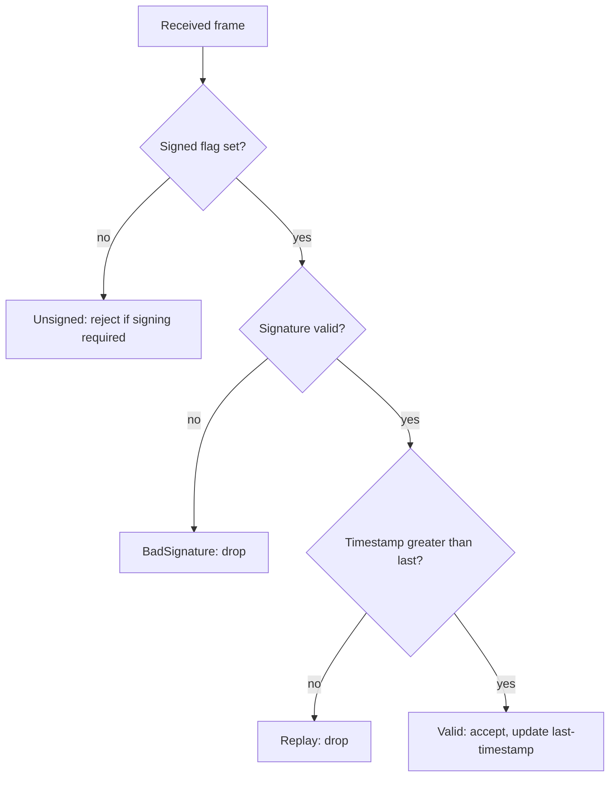

# UAS MAVLink Hardening — remediation for the capstone findings

*The remediation counterpart to the [capstone assessment](uas-capstone-assessment.md):
the assessment measured which threat-model SHALL requirements the open autopilot stack
fails; this writeup documents the **specific hardening techniques** that close them, how to
apply and verify each, and the residual risk. It is deliberately honest about what was
**applied** in the lab versus what is **recommended** but not yet applied.*

> **Scope.** UNCLASSIFIED, open-source stack (ArduPilot/PX4 + public MAVLink), simulation
> and owned-hardware only. Techniques are framed for the **Group 3+** class the target
> market fields (BLOS/SATCOM C2, encrypted datalinks, GPS-denied operation, the GCS as an
> attack surface), even though the SITL lab models a generic airframe. See
> [`docs/disclosure-policy.md`](../disclosure-policy.md).

**Status legend:** **[applied]** demonstrated in the lab · **[recommended]** prescribed, not
yet applied · **[verified]** already met, confirmed. Findings/threat IDs are from the
[threat model](uas-autopilot-threat-model.md) §5/§8.

| Finding | Technique | Status | Verification |
|---------|-----------|:------:|--------------|
| T1 / T5 — command authenticity & anti-replay | MAVLink v2 signing + monotonic timestamp | **[applied]** | harness before/after; P6.2 tests |
| T4 — telemetry confidentiality | link / transport-layer encryption | **[recommended]** | re-run harness on the encrypted transport |
| T6 — link-loss failsafe | operator-set failsafe to a safe state | **[verified]** | harness param read; link-kill test |
| T3 — firmware integrity | signed firmware / secure boot | **[recommended]** | corrupt-image negative test |
| T2 — position integrity | GNSS multi-sensor cross-check; anti-spoof/jam GNSS | **[recommended]** | SITL/HIL sensor injection |
| T7 — companion segmentation | command allowlist + rate-limit, least privilege | **[recommended]** | disallowed-command test |

---

## 1. Command authenticity & anti-replay (T1, T5) — MAVLink v2 signing **[applied]**

**The gap (measured).** On the stock link every frame was unsigned, an unsigned command
was accepted, and a byte-identical frame was re-accepted — the autopilot cannot tell an
authorized operator from any actor on the RF medium (ATT&CK-ICS **T0855**). This is the
defect **CVE-2026-1579** scores at **CVSS 9.8** on PX4 (signing off ⇒ unauthenticated
`SERIAL_CONTROL` shell ⇒ RCE; CWE-306, CISA ICSA-26-090-02) — the control below is its
published mitigation, implemented as an enforceable module rather than a config toggle.

**The technique.** MAVLink v2 message signing. A signed frame sets `incompat_flags` bit
`0x01` and appends a 13-byte block after the payload CRC: `link_id` (1) + `timestamp` (6,
little-endian) + `signature` (6). The signature is the first 48 bits of
`SHA-256(secret_key ‖ frame ‖ link_id ‖ timestamp)` with a 32-byte key. The 48-bit
timestamp (10 µs units) must be **strictly monotonic** per `(sysid, compid, link_id)`; a
receiver rejects any frame whose timestamp is not greater than the last accepted one — this
is the anti-replay (T5), and it falls out of signing for free.

**How to apply (ArduPilot / PX4).**
- Establish signing on each link with a shared 32-byte key (ArduPilot: `SETUP_SIGNING`,
  e.g. MAVProxy `signing setup <passphrase>`, which derives the key and keys both ends;
  PX4 exposes an equivalent signing setup). Once keyed, the vehicle rejects unsigned
  commands on that link.
- **Enforcement is per link/channel.** Enable signing on *every* link that must require it
  (primary telemetry radio, companion link, each GCS output) and verify each independently —
  a key set on one channel does not automatically harden a second, parallel channel.
- Set the policy to **reject unsigned** where signing is required (do not merely accept both).

**Key management (the part that's easy to get wrong).**
- Treat the 32-byte key as a secret: distribute it out-of-band, never hardcode it in a GCS
  config committed to source, and prefer per-link keys over one global key.
- Rotate keys on a schedule and on personnel/asset change; on real hardware, store the key
  in a secure element / TPM rather than flash where practical (ties to the
  [secure-boot / RoT](secure-boot-root-of-trust.md) key-hierarchy discussion).

**Implementation.** A memory-safe reference implementation of exactly this
(sign / verify / anti-replay) is the **P6.2** module —
[`tools/mavlink-signing/`](../../tools/mavlink-signing/SPEC.md) — `#![forbid(unsafe_code)]`,
zero external dependencies, cross-checked byte-for-byte against pymavlink. It is
**MIT-licensed** — permissive like PX4's BSD-3, so an integrator could actually adopt it (a
GPLv3 control they would not): the build-side answer to CVE-2026-1579's "enable signing"
guidance, as enforceable code rather than a toggle.

**Verification.** The [capstone](uas-capstone-assessment.md) §5 before/after: enabling signing
flips `signing` to PASS and the injection/replay attacks stop succeeding; the deterministic
proof (unsigned → reject, signed → valid, replayed → reject) is the P6.2 `cargo test` suite.

**Residual risk.** Signing **authenticates, it does not encrypt** — telemetry stays in
cleartext (see T4). A compromised key defeats the scheme (hence rotation + secure storage).
A fully-compromised authorized GCS acting within its own authority is out of band for the
autopilot.

## 2. Telemetry confidentiality (T4) — link / transport encryption **[recommended — not applied]**

**The gap (measured).** With a stream requested, the harness decoded five cleartext telemetry
types (`ATTITUDE`, `GLOBAL_POSITION_INT`, `GPS_RAW_INT`, `VFR_HUD`, `BATTERY_STATUS`) — position,
attitude, and battery state disclosed to any passive listener. MAVLink has **no built-in
encryption**, and signing does not add it, so this remains **FAIL** in the lab.

**The technique (options, by integration level).**
- **Encrypted datalink / radio:** use a radio that encrypts the RF link (AES-class),
  especially for the Group 3+ BLOS/SATCOM C2 datalink. Highest assurance; moves the problem
  to radio key management.
- **Transport tunnel:** carry MAVLink inside an encrypted tunnel (WireGuard / IPsec / DTLS)
  on the IP segment between the GCS and an onboard companion computer. Practical when a
  Linux companion terminates the link; adds latency and its own key management.
- **Constraint:** a bare flight-MCU serial radio may lack the compute for a heavy tunnel —
  push encryption to the radio or the companion, not the flight MCU.

**Verification.** Re-run the harness against the encrypted transport: the telemetry check
should find **no cleartext MAVLink** (the payload rides inside the tunnel). Until then, T4 is
honestly recorded as unmet.

**Residual risk.** Traffic-analysis / metadata (timing, volume) can still leak activity;
endpoint compromise bypasses link encryption.

## 3. Link-loss failsafe (T6) — operator-set safe state **[verified]**

**Status.** Met in the lab (`FS_THR_ENABLE=1.0`). This is a **safety** default, not a security
control, so treat it as necessary-but-not-sufficient: ensure the failsafe **action** is
operator-set to a defined safe state (RTL / land / hold) and that "link loss" cannot be cheaply
induced to force a predictable RTL toward an attacker-chosen point (that abuse ties to T2 GNSS
integrity and to jamming, T6-DoS).

**Verification.** The harness reads the failsafe parameter non-intrusively; a fuller test kills
the link in SITL and confirms the vehicle enters the configured state.

## 4. Out-of-harness hardening (recommended)

These close threat-model requirements the MAVLink harness does not exercise:

- **T3 — signed firmware / secure boot:** the bootloader verifies a signature over firmware
  and parameters before execution; negative test = flip a byte in a signed image → refused.
  See [`secure-boot-root-of-trust.md`](secure-boot-root-of-trust.md).
- **T2 — GNSS integrity:** multi-sensor consistency (IMU/baro/optical-flow cross-check) to
  detect spoofing and enter a safe state; on Group 3+, anti-spoof / anti-jam (M-code-class)
  GNSS. Test via SITL/HIL sensor injection.
- **T7 — companion-computer segmentation:** the companion may issue only an **allowlisted,
  rate-limited** set of flight commands; least-privilege interface between the general-purpose
  Linux host and the safety-critical MCU. Ties to
  [`embedded-hardening-writeup.md`](embedded-hardening-writeup.md).
- **T9 / T10 — supply chain & non-repudiation:** reproducible + signed builds; tamper-evident
  command/mode logging.

## 5. Applied-vs-recommended summary

In this lab we **applied** MAVLink v2 signing (T1/T5) and **verified** the failsafe (T6);
everything else is **prescribed** with a concrete technique and a verification method but not
yet implemented. That separation is the point of an honest hardening writeup — it says exactly
how far the system has actually been hardened, not how far it could be.

## References
- [UAS capstone assessment](uas-capstone-assessment.md) · [threat model](uas-autopilot-threat-model.md)
  §8 (requirements) / §9 (Prevent-Mitigate-Recover)
- [P6.2 MAVLink v2 signing module](../../tools/mavlink-signing/SPEC.md)
- [Secure-boot / root-of-trust](secure-boot-root-of-trust.md) · [Linux node hardening](embedded-hardening-writeup.md)
- MAVLink message-signing specification; ArduPilot / PX4 security documentation.

---

### Competencies this artifact demonstrates
- **Firmware/embedded security assessment → hardening** on a defense-relevant class (the
  remediation half of the assessment loop).
- **Secure boot / key management** (signing key lifecycle; RoT linkage).
- **Cyber T&E** — every technique paired with a verification method, applied vs. recommended
  stated honestly.
