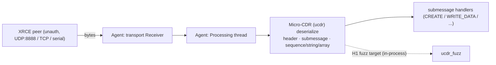

# Phase 2 · H1 — Micro-CDR (`ucdr`) decode fuzz-harness spec

*The executable harness spec for **H1** of the [Phase 2 scope](phase2-micro-xrce-dds-scope.md) —
the highest-**novelty-headroom** hypothesis: **does the Micro-XRCE-DDS Agent's `ucdr` decode
path overrun its buffer on a crafted submessage** beyond the two known field-validation DoS
CVEs? It is the memory-safety complement to [H5](phase2-h5-test-procedure.md): where H5 asked a
missing-**authentication** question on the wire and stalled at entity creation, H1 asks a
missing-**bounds-check** question one layer down, entirely offline. This is the [run-results §8
pivot](phase2-h5-test-results.md): the prize sits in the Agent's entity-creation / CDR parser,
not in "does PX4 execute my ARM."*

> **Status: SPEC (drafted 2026-09-21).** No fuzzing run yet; §5 is the run-record stub to fill.
> The harness skeleton is committed and self-tests today ([`ucdr_fuzz/`](ucdr_fuzz/)). Every
> crash passes the **dedup gate (§6) before any novelty claim** — a clean run ships as a
> rigorous negative result (the DrayTek ethos: value ships either way).

> **Scope, safety & ethics.** UNCLASSIFIED, open-source (eProsima Micro-CDR, Micro-XRCE-DDS-
> Agent/-Client — all public, Apache-2.0). **DEFENSIVE and OFFLINE:** the harness parses
> attacker-controlled **bytes in-process** — no network, no Agent, no vehicle. Any seed capture
> is **loopback-only** on a host you own. Coordinated disclosure; personal COI / outside-
> activity reporting **before** any outbound contact
> ([`disclosure-policy.md`](../../docs/disclosure-policy.md) §5). No committed blobs/corpora.

## 1. Claim under test (SHALL-style)

Derived from the trust boundary TB-X1 (client → agent, untrusted by default):

> *The Agent's XRCE/CDR deserializer SHALL NOT read or write outside its buffers for **any**
> byte string an unauthenticated peer can place on the transport — regardless of length
> prefixes, alignment, fragment offsets, or field values.*

A violation is a memory-safety bug (OOB read/write, over-large or zero allocation, UB) reachable
pre-authentication — the class of the two known Agent CVEs, but on the **length-prefixed**
primitives they did not cover:

- **CVE-2025-63547** — crafted **MTU length** ⇒ DoS (CVSS 7.5), Agent v3.0.1.
- **CVE-2025-63548** — invalid **Boolean** value ⇒ improper validation ⇒ internal exception ⇒
  resource exhaustion (DoS, CVSS 7.5), v3.0.1.

Both are single-field edge checks. `ucdr`'s `sequence` / `string` / `array` decoders — which
read an attacker-controlled length then copy that many elements — are the classic bounds-check
gap and are **not** covered by either CVE. That gap is H1.

## 2. Target & system under test

Untrusted bytes enter at the Agent's transport receiver and flow to the CDR decoder:



Two fuzz targets, cheapest-first:

| # | Target | What it is | Effort | Why |
|---|--------|-----------|:------:|-----|
| **A (primary)** | **`ucdr` decode primitives, in-process** | link Micro-CDR; drive header + `sequence`/`string`/`array` decoders with fuzz bytes | **low** | fastest, deterministic, self-contained; isolates the exact H1 bug class. Skeleton: [`ucdr_fuzz/`](ucdr_fuzz/) |
| B (fidelity) | **Agent XRCE message-parse entry** | link the Agent's Processing/CDR objects; fuzz the first function that touches received bytes | med–high | closer to the network-reachable surface; also reaches H2 (FRAGMENT reassembly) and H3 (entity XML) from the same rig |

Start with **A** (it is what `ucdr_fuzz/` builds); graduate the interesting corpus to **B** to
confirm reachability from the real Agent entry before any disclosure claim.

**Source under test (pin commits, record hashes here on the run):**

| Repo | Commit | SHA-256 (tarball) | vs. known CVEs |
|------|--------|-------------------|----------------|
| `eProsima/Micro-CDR` | _pending_ | _pending_ | — |
| `eProsima/Micro-XRCE-DDS-Agent` | _pending_ | _pending_ | fixed **after** v3.0.1 (63547/63548) — fuzz **≥** the fixed tag so old bugs don't mask new ones |
| `eProsima/Micro-XRCE-DDS-Client` | _pending_ | _pending_ | seed-capture only |

## 3. Build & instrumentation

| Config | Compiler | Flags | Catches |
|--------|----------|-------|---------|
| libFuzzer (primary) | Clang | `-g -O1 -fsanitize=fuzzer,address,undefined -fno-omit-frame-pointer -fno-sanitize-recover=all` | OOB r/w, UB, bad alloc |
| AFL++ (alt.) | `afl-clang-fast` | `-fsanitize=address,undefined` + the standalone driver | same, coverage-guided |
| TSan (H6 spillover) | Clang | `-fsanitize=thread` | races on shared decode state |
| Standalone (self-test) | any `cc` | `-DUCDR_FUZZ_STANDALONE -fsanitize=address,undefined` | logic check + crash replay anywhere |

Triage env: `ASAN_OPTIONS=abort_on_error=1:detect_leaks=1:strict_string_checks=1`,
`UBSAN_OPTIONS=print_stacktrace=1:halt_on_error=1`. The harness copies each input into an
**exactly-sized** heap allocation so an over-read past the frame is a hard ASan
heap-buffer-overflow, not a silent read into slack.

Build + self-test:

```bash
cd research/uas-autonomy/ucdr_fuzz
CC=clang cmake -B build && cmake --build build -j"$(nproc)"
./build/ucdr_fuzz_standalone --selftest      # deterministic; needs no fuzzing engine
```

## 4. Corpus & seed plan

A length-prefix fuzzer converges far faster from **real frames** than from zero. Seed order:

1. **Live loopback capture (best seeds).** Run the Phase 1 SITL rig so PX4's
   `uxrce_dds_client` talks to a local Agent, capture the XRCE UDP payloads, strip UDP headers
   to raw XRCE frames:
   ```bash
   MicroXRCEAgent udp4 -p 8888 &                 # loopback only
   cd ~/PX4-Autopilot && HEADLESS=1 make px4_sitl gz_x500
   sudo tcpdump -i lo udp port 8888 -w xrce.pcap  # short window: session setup + CREATE_* + WRITE_DATA
   # extract each UDP payload as one seed file (tshark; -T fields -e data = raw XRCE frame):
   tshark -r xrce.pcap -Y 'udp.port==8888 && data.len>0' -T fields -e data \
     | while read -r hex; do printf '%s' "$hex" | xxd -r -p > "seeds/$(date +%s%N).bin"; done
   ```
   Provenance (capture host, date, PX4/Agent versions) goes in §5 — the bytes stay git-ignored.
2. **Known-CVE regression seeds.** Hand-craft the **MTU=0** (63547) and **invalid-boolean**
   (63548) frames so the corpus always covers the two documented shapes — these are also baked
   into the harness `--selftest`.
3. **Hand-crafted minimal submessages.** One `CREATE` (participant, with a small entity XML/
   binary rep) and one `WRITE_DATA` frame, from the OMG DDS-XRCE layout — the shortest paths
   into the entity + payload decoders.

Minimize before keeping: `./build/ucdr_fuzz -merge=1 corpus/ seeds/` then `-minimize_crash=1`
on any finding.

## 5. Run record — *pending first execution*

| Field | Value |
|-------|-------|
| Run date | _pending_ |
| Host / OS | _pending (WSL Ubuntu)_ |
| Micro-CDR / Agent commit | _pending_ |
| Fuzzer / sanitizers | _pending (libFuzzer + ASan/UBSan)_ |
| Corpus size / provenance | _pending_ |
| Exec/s · total execs · peak RSS | _pending_ |
| Coverage (edges) | _pending_ |
| Crashes (unique, post-minimize) | _pending_ |
| Outcome | _pending — see §6 classification_ |

## 6. Dedup gate — run BEFORE any novelty claim

H1's headline risk is **re-reporting a known bug or an already-fixed one.** For each unique,
minimized crash:

1. **Fix-state first.** Reproduce on the **latest** Micro-CDR/Agent tag. A crash that only fires
   on ≤ v3.0.1 is likely one of 63547/63548 or an already-patched issue → not novel.
2. **NVD / OpenCVE / GHSA** on `eProsima/Micro-CDR` and `eProsima/Micro-XRCE-DDS-Agent`; read
   each repo's `SECURITY.md` + closed advisories + recent bugfix commits (the lib has prior
   alignment / zero-length-sequence fixes — confirm yours is distinct).
3. **Classify** per [`known-territory.md`](known-territory.md) §6: **MINED** (known/fixed →
   regression note) / **PARTIAL** (variant → angle it) / **THIN** (novel → coordinated
   disclosure to **eProsima**, the CNA for Agent/CDR).

| Crash class | Likely severity | Route |
|-------------|-----------------|-------|
| OOB **read** / crash (DoS) | med (≈7.5, the known-CVE band) | eProsima advisory if novel + distinct from 63547/63548 |
| OOB **write** / controllable corruption | high | coordinated disclosure, minimal PoC, CVSS via `finding-to-vendor-report` |
| Over-large / zero alloc, unbounded recursion | med (DoS) | as above; note reachability from the Agent entry (target B) |
| Error-set, no memory violation | **none — safe** | the negative result; feeds §8(b) |

## 7. Build side — the remediation (break/build symmetry)

Whichever way the dedup lands, the engineering deliverable is the fix, framed for the Group 3+
class the market fields:

- **Upstream patch:** the missing bounds/length/alignment check in `ucdr` (or the Agent
  handler), with the crashing seed added as a regression test — an adoptable PR, not just a bug.
- **Defense-in-depth:** the harness itself as a **reusable CI fuzz target** (OSS-Fuzz-style
  `LLVMFuzzerTestOneInput`) so the parser stays fuzzed — the durable control.
- **Deployment note:** carry H5's posture — bind the Agent to loopback / a segmented interface
  and require DDS-Security so the decoder is not exposed to arbitrary peers in the first place.

This mirrors Phase 1's P6.2 signing module and H5's DDS-Security "after": find the gap, ship the
adoptable control.

## 8. Deliverable / DoD (P7.2 — value ships either way)

- **(a) Novel finding** → unique crash, minimized PoC, reproduced on the latest tag, dedup-clean
  → `finding.json` →
  [`finding-to-vendor-report`](../../.claude/skills/finding-to-vendor-report/SKILL.md) (CVSS) →
  coordinated disclosure to **eProsima** → CVE writeup, **plus** the §7 patch + CI target.
- **(b) Rigorous negative result** → fuzzing stayed clean at documented coverage/time → a written
  assessment: entry mapped, corpus + coverage reported, the length-prefixed invariants shown to
  hold, and a coverage-gap note back to [`known-territory.md`](known-territory.md). Still a
  credible product-security artifact — and the harness ships regardless.

## 9. Connect-the-work & sources

- Hypothesis source & ranking: [`phase2-micro-xrce-dds-scope.md`](phase2-micro-xrce-dds-scope.md) (H1).
- The pivot that elevated H1: [`phase2-h5-test-results.md`](phase2-h5-test-results.md) §8.
- Dedup basis & disclosure channels: [`known-territory.md`](known-territory.md).
- Harness skeleton (buildable, self-tests today): [`ucdr_fuzz/`](ucdr_fuzz/).
- Micro-CDR repo: <https://github.com/eProsima/Micro-CDR> · Agent: <https://github.com/eProsima/Micro-XRCE-DDS-Agent>
- CVE-2025-63547 (MTU length ⇒ DoS): <https://app.opencve.io/cve/CVE-2025-63547> · CVE-2025-63548 (Boolean ⇒ DoS): <https://app.opencve.io/cve/CVE-2025-63548>
- OMG DDS-XRCE wire spec (message/submessage layout — confirm exact fields in source): <https://www.omg.org/spec/DDS-XRCE>
