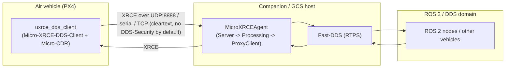

# Phase 2 — micro-XRCE-DDS Agent target scope (novel-CVE hunt)

*The scoping document for [Run 4](../../docs/track1-uas-run-plan.md) Phase 2 (deliverable
P7.2). Phase 0's [known-territory map](known-territory.md) ranked the **eProsima
Micro-XRCE-DDS Agent** the thinnest-covered layer in the PX4/ROS 2 stack (2 public CVEs,
both simple DoS) — this doc turns "the Agent is the target" into a concrete, prioritized
hunt: where untrusted bytes enter, which parsers touch them, which trust boundary matters,
and the specific hypotheses worth deep RE time.*

> **Status: SCOPE (drafted 2026-09-21).** No exploitation yet. Every candidate below is a
> hypothesis to confirm through source RE + a harness, and **must clear the Phase 0 dedup
> gate before deep time**. Verified facts carry a source (§9); hypotheses are labelled H#.

> **Scope & ethics.** UNCLASSIFIED, open-source targets (Micro-XRCE-DDS-Agent, Micro-CDR,
> Micro-XRCE-DDS-Client, Fast-DDS — all public, Apache-2.0). Simulation/loopback + owned
> hosts only. Coordinated disclosure; personal COI / outside-activity reporting **before**
> any outbound contact ([`disclosure-policy.md`](../../docs/disclosure-policy.md) §5). No
> committed blobs.

## 1. Why this target (the one-line thesis)

The **Micro-XRCE-DDS Agent** is the broker that bridges resource-constrained XRCE **Clients**
(e.g. the PX4 flight controller's `uxrce_dds_client`) into the full **DDS / ROS 2** dataspace.
It is:
- **The Lattice-flavored layer** — pub/sub autonomy middleware bridging vehicles into a mesh,
  the closest *open* analog to a proprietary decentralized C2 fabric (Run 4 §2).
- **Under-reviewed** — only **CVE-2025-63547** (CREATE_CLIENT MTU length = 0 ⇒ zero-size alloc
  ⇒ crash) and **CVE-2025-63548** (invalid Boolean ⇒ unhandled exception ⇒ resource
  exhaustion), both v3.0.1 DoS. The parser has clearly had shallow input-validation testing.
- **Deployed unauthenticated by default** — PX4's default uXRCE-DDS setup runs **no
  DDS-Security** (no auth, no encryption); the Client connects to `MicroXRCEAgent udp4 -p 8888`
  in the clear. This is the **same "missing authentication for a critical function" pattern as
  [CVE-2026-1579](known-territory.md)** (MAVLink signing off by default) — one layer up.

## 2. System & data flow

**Untrusted input enters at the Agent's transport receiver** (UDP 8888 / TCP / serial / CAN).
Any peer that can reach that socket — or, past the bridge, any peer on the DDS domain — is an
attacker in the threat model. The Agent's four-thread server (Sender / **Receiver** /
**Processing** / Heartbeat) hands received bytes to the Processing thread, which deserializes
XRCE with **Micro-CDR (`ucdr`)** and acts on the ProxyClient/DDS entities.

## 3. Trust boundaries & privilege model

- **TB-X1 (client ↔ agent):** the XRCE wire. Untrusted, unauthenticated by default. The
  Agent must treat every field as hostile — the known CVEs show it does not (MTU=0, bad bool).
- **TB-X2 (agent ↔ DDS domain):** client-controlled topic names, type definitions, and
  payloads cross into Fast-DDS. A bug here inherits the **Fast-DDS RTPS/CDR CVE history**
  (Phase 0 §2.2) — but reached *through the Agent* from an XRCE client.
- **TB-X3 (PX4 integration seam):** which PX4 topics the bridge exposes, and whether an
  unauthenticated XRCE/DDS peer can **publish to command-bearing topics** (offboard setpoints,
  vehicle commands). This is the highest-impact boundary and the least publicly examined.
- **Privilege / blast radius:** the Agent typically runs as a normal user on the companion/GCS,
  but its *reach* is the whole DDS domain and, via TB-X3, the flight stack's ROS 2 command
  surface. Impact is measured by what the domain can do, not the Agent's local uid.

## 4. Attack surface (layered — where to point the reverser)

| Layer | Surface | Parser / code | Known? |
|-------|---------|---------------|:------:|
| **L1 Transport/framing** | UDP/TCP/serial/CAN length-delimited framing; MTU/length fields | transport Server layer | **CVE-2025-63547** (MTU=0) — MINED at the trivial edge |
| **L2 XRCE message parse** | message header (`sessionId`, `streamId`, `sequenceNr`, optional `clientKey`); submessage header (`submessageId`, `flags`, `submessageLength`) | Processing thread + **Micro-CDR `ucdr`** deserialize | THIN — only bool/MTU checks known |
| **L3 Submessage bodies** | CREATE_CLIENT, CREATE, DELETE, WRITE_DATA, READ_DATA, ACKNACK, HEARTBEAT, **FRAGMENT**, GET_INFO | per-submessage handlers | THIN |
| **L4 Entity representation** | CREATE carries a **DDS XML profile**, a **binary** representation, or a **reference** for participant/topic/pub/sub | XML parser (Fast-DDS profiles) / binary-rep parser | THIN — XML surface essentially unexamined publicly |
| **L5 Session/stream state** | session establishment, best-effort vs reliable streams, sequence numbers, **fragment reassembly**, ACKNACK/HEARTBEAT reliability | ProxyClient / stream manager | THIN |
| **L6 PX4 integration seam** | default topic allowlist, offboard/command topics, no DDS-Security default | PX4 `uxrce_dds_client` config + dds_topics.yaml | **unexamined** |

## 5. Candidate hypotheses (ranked)

Ranked by *expected value* = novelty headroom × impact. Each names a test.

- **H1 — Micro-CDR (`ucdr`) OOB read/write on crafted submessage payloads** *(memory-safety;
  most likely a clean CVE).* Beyond the known bool/MTU checks, deserializing sequences/strings/
  arrays with attacker-controlled length or alignment is the classic bounds-check gap (the lib
  has prior alignment bugfixes, e.g. zero-length-sequence). **Test:** ASan/UBSan build + a
  libFuzzer/AFL++ harness on the XRCE message-parse entry, seeded with real client traffic.
- **H2 — FRAGMENT reassembly overflow / OOM** *(memory-safety / resource).* Multi-fragment
  XRCE messages reassemble into a growing buffer; length/offset/total-size handling is a common
  overflow/OOM spot and is more complex than the single-packet path the known CVEs hit.
  **Test:** craft fragmented CREATE/WRITE_DATA with inconsistent lengths; watch allocation + bounds.
- **H3 — Entity-representation parsing (XML / binary) in CREATE** *(parser bugs; resource
  exhaustion).* The Agent parses a Fast-DDS **XML profile** (or binary rep) from a CREATE
  submessage — an XML attack surface (entity-expansion/deep-nesting DoS; parser edge cases) that
  no public CVE touches for this path. **Test:** CREATE with malformed/oversized/deeply-nested XML;
  measure the Fast-DDS XML parser reached through the Agent.
- **H4 — Session/authz state confusion at TB-X1** *(logic; impact > DoS).* Can a peer forge or
  reuse a `clientKey`/`sessionId` to act on **another client's** entities, or drive
  sequence-number/stream state into an inconsistent condition? A cross-client read/write or
  entity hijack is a confidentiality/integrity finding, not just a crash — the sleeper for a
  higher-severity result. **Test:** two clients + a third forging session/clientKey fields;
  check entity isolation.
- **H5 — PX4 integration seam: unauthenticated command injection via the bridge** *(highest
  impact; most Lattice-flavored).* If PX4's **default** uXRCE-DDS config (no DDS-Security)
  exposes **writable command topics** (offboard setpoints, `VehicleCommand`) to any XRCE/DDS
  peer that reaches the Agent, that is missing-authentication on a flight-critical function —
  the DDS-side analog of the MAVLink T1/CVE-2026-1579 story, potentially **novel for the PX4
  integration**. **Test:** stand up PX4 SITL + Agent; from an *unrelated* DDS/XRCE peer, attempt
  to publish to command topics and observe flight-stack effect in SITL. **Dedup carefully** — the
  "MAVLink-signing-off" class is CVE'd; confirm the *DDS-bridge* instance is not already covered.
  → **Executable procedure: [`phase2-h5-test-procedure.md`](phase2-h5-test-procedure.md)** (runs on
  the Phase 1 SITL rig; clause-1 command + clause-2 confidentiality, dedup gate, DDS-Security "after").
- **H6 — Agent multi-thread races (Sender/Receiver/Processing/Heartbeat)** *(memory-safety;
  UAF/TOCTOU).* Session teardown vs. in-flight processing on shared ProxyClient state — the same
  race shape as PX4 **CVE-2026-32724** (`MavlinkShell` UAF), one component over. **Test:** TSan
  build; churn CREATE_CLIENT/DELETE while streaming WRITE_DATA.

**Priority:** start **H1 + H5 in parallel** — H1 is the most likely *clean* CVE (fuzz the thin
parser), H5 is the highest-*impact*, most role-relevant result (and may be a rigorous
negative-result assessment if PX4's defaults are safe — either outcome ships, the DrayTek ethos).
H4 is the sleeper worth a focused day.

## 6. Methodology (the hunt loop)

1. **Acquire source** (pin commits, record hashes): `eProsima/Micro-XRCE-DDS-Agent`,
   `eProsima/Micro-CDR`, `eProsima/Micro-XRCE-DDS-Client`, `eProsima/Fast-DDS`, and PX4's
   `uxrce_dds_client`. Note versions vs. the two known CVEs (fixed after v3.0.1).
2. **Instrumented build** — Agent + Micro-CDR with **ASan + UBSan** (H1/H2/H3) and a **TSan**
   variant (H6).
3. **Map the parse entry** — trace transport Receiver → Processing thread → `ucdr` deserialize →
   submessage handlers; identify the single function that first touches attacker bytes (the fuzz
   target).
4. **Fuzz** — libFuzzer/AFL++ on that entry, seed corpus captured from a real
   `uxrce_dds_client`↔`MicroXRCEAgent` session (loopback); prioritize L2/L3/L5 paths.
5. **Live rig for H4/H5** — PX4 SITL + `MicroXRCEAgent udp4 -p 8888`; a separate ROS 2 / XRCE
   peer as the attacker; probe entity isolation (H4) and writable command topics (H5).
6. **Every candidate → Phase 0 dedup gate** (known-territory §6): NVD/OpenCVE/GHSA on *each*
   repo, CISA/vendor notes, arXiv/Alias Robotics. Only THIN/angled candidates go deep.
7. **Confirm & disclose** — reproduce minimally; `finding.json` →
   [`finding-to-vendor-report`](../../.claude/skills/finding-to-vendor-report/SKILL.md) (CVSS) →
   coordinated disclosure → [`finding-to-cve-writeup`](../../.claude/skills/finding-to-cve-writeup/SKILL.md).

## 7. Environment, tooling & guardrails

- Linux host (WSL ok for build/fuzz); loopback only for the XRCE/DDS traffic; no traffic to
  networks you don't own. SITL for any flight-stack effect (H5) — never real hardware.
- Fuzzers: libFuzzer (in-process, fastest for the parser) or AFL++; sanitizers as above.
- **Blobs git-ignored**; record source commit hashes + corpus provenance in
  `research/uas-autonomy/` paperwork, not the binaries/corpus.

## 8. Deliverables & definition-of-done (P7.2)

Value ships **either way**:
- **(a) Novel finding** → confirmed, minimally reproduced, carried into coordinated disclosure
  (CVE requested via the right CNA — eProsima for the Agent/CDR, PX4/Dronecode for the
  integration seam), plus a **build-side** deliverable (a hardened Agent config / a DDS-Security
  + SROS2 policy set / a locked-down `dds_topics.yaml`), keeping the break/build symmetry; **or**
- **(b) Rigorous negative result** → a written security assessment of the XRCE bridge layer
  (surface mapped, hypotheses tested, why they held), which is itself a credible product-security
  artifact and updates the known-territory map.

## 9. Sources (verified 2026-09-21)

- Micro-XRCE-DDS Agent overview / architecture (Server layer, ProxyClient, threads): <https://micro-xrce-dds.docs.eprosima.com/en/latest/agent.html> · intro: <https://micro-xrce-dds.docs.eprosima.com/en/latest/introduction.html>
- Agent repo: <https://github.com/eProsima/Micro-XRCE-DDS-Agent> · Micro-CDR (`ucdr`): <https://github.com/eProsima/Micro-CDR>
- CVE-2025-63547 (CREATE_CLIENT MTU length = 0 ⇒ crash): <https://app.opencve.io/cve/CVE-2025-63547> · CVE-2025-63548 (Boolean validation ⇒ resource exhaustion): <https://app.opencve.io/cve/CVE-2025-63548>
- PX4 uXRCE-DDS bridge (client/agent, UDP 8888, `UXRCE_DDS_*` params, topics): <https://docs.px4.io/main/en/middleware/uxrce_dds> · <https://docs.px4.io/main/en/ros2/user_guide>
- OMG **DDS-XRCE** wire-protocol spec (message/submessage authority; confirm exact layouts in source): <https://www.omg.org/spec/DDS-XRCE>
- Dedup basis + disclosure channels: [`known-territory.md`](known-territory.md)
