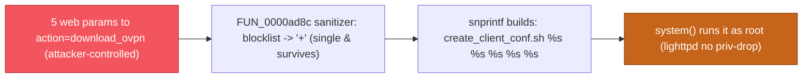

# Rediscovering an n-day by patch-diffing: DrayTek Vigor300B `mainfunction.cgi` `download_ovpn` command injection (CVE-2024-45890 class)

**Severity:** 7.2 (High) — `CVSS:3.1/AV:N/AC:L/PR:H/UI:N/S:U/C:H/I:H/A:H` (this 300B instance; the CVE's own assigner scores CVE-2024-45890 at 8.0)
**Affected:** DrayTek Vigor300B, firmware ≤ 1.5.1.6
**Fixed in:** 1.5.1.7 (silent — no advisory, 2026-09-03 build)
**Class:** Post-authentication OS command injection via incomplete-blocklist sanitizer bypass (CWE-78; contributing CWE-184)
**Maps to:** CVE-2024-45890 (DrayTek `mainfunction.cgi` `action=download_ovpn` command injection, assigned on the sibling Vigor3900)
**Researcher:** samyoon727ca

## TL;DR
> The `download_ovpn` action of DrayTek's `mainfunction.cgi` builds a shell command
> from five web parameters and runs it with `system()`. A per-parameter sanitizer
> tries to strip shell metacharacters, but its blocklist is incomplete — a single
> `&` survives — so an authenticated operator/admin can inject commands that run as
> **root**. DrayTek silently closed it on the Vigor300B in v1.5.1.7 by single-quoting
> the arguments. **This is not a new disclosure:** the same `download_ovpn` bug is
> already **CVE-2024-45890**, assigned on the sibling Vigor3900. This writeup is a
> **patch-diff case study** that rediscovers the bug on the 300B by diffing the
> public firmware chain — and it doubles as a cautionary tale about how a
> single-model dedup nearly mislabeled a known n-day as novel.

## The target
- **Device:** DrayTek Vigor300B — a Linux-based broadband/VPN business edge router.
- **SoC / arch:** Mindspeed/Freescale **Comcerto 1000**, **ARM ELF32 little-endian**,
  Linux 2.6.33.5 (confirmed from the image via `readelf`, not the datasheet).
- **Firmware pair analyzed:** `1.5.1.6` (vulnerable) vs `1.5.1.7` (fixed). Both were
  downloaded over HTTPS from DrayTek's public, fully-versioned firmware archive
  (`fw.draytek.com.tw`); the SHA-256 of every archive and inner image was recorded
  before analysis.
- **Container:** DrayTek `.all` flash image → 0x30-byte vendor header → **UBI**/**UBIFS**
  `rootfs` volume. Extraction carves from offset `0x30` and unpacks with `ubi_reader`
  (no root needed), yielding ~2,500 files.

DrayTek's public archive is an ideal patch-diffing substrate: every release,
including current security patches, is downloadable, so the fix is always
provenance-acquirable to diff against the version before it.

## How it was found (methodology)
The point of this writeup is the repeatable funnel, not the bug.

1. **Acquire + fingerprint.** Pulled the Vigor300B firmware ladder from the vendor's
   public archive. Fingerprinting the image (not the spec sheet) established
   Comcerto / ARM **little-endian** / Linux 2.6.33.5. The ELF headers are
   authoritative for the Ghidra load spec (`ARM:LE:32`).

2. **Version-to-version binary diff.** Unpacking both root filesystems and ranking
   changed binaries by security relevance floated **`www/cgi-bin/mainfunction.cgi`**
   to the top. The **string delta** was the tell: several `system()`-style command
   templates changed from unquoted `%s` to single-quoted `'%s'` between 1.5.1.6 and
   1.5.1.7 — the classic **silent command-injection hardening** signature.

3. **Isolate the un-hardened outlier.** Most of the changed templates (e.g.
   `gretunnel`/`ssltunnel disconnect_from_web '%s'`) were *already* quoted in
   1.5.1.6. The OpenVPN path was the one still unquoted that got quoted:
   `/etc/openvpn/create_client_conf.sh %s %s %s %s %s` → `'%s' '%s' '%s' '%s' '%s'`.

4. **Ghidra confirmation.** Decompiling the 1.5.1.6 handler (`FUN_0001e9d8`, the
   target of action `download_ovpn`) shows five `cgiGetValue()` reads, each passed
   through an in-place sanitizer (`FUN_0000ad8c`) before `snprintf` builds the
   command and `system()` runs it. The handler is gated on session privilege
   `level > 3` — resolved from the disassembly to mean an authenticated
   **operator (4) or admin/root (7)** session, not an unauthenticated caller.

5. **Decode the sanitizer from the disassembly.** Rather than trust the decompiler,
   the sanitizer's comparison chain was read straight from the ARM disassembly — a
   byte-by-byte blocklist (see Root cause). That is what proved the bypass.

6. **Dedup gate — and where it went wrong (see below).** The path was first checked
   against NVD, OpenCVE's `vigor300b_firmware` list, and DrayTek's 300B advisories,
   which turned up nothing on the OpenVPN path — an *apparently* novel finding. A
   later, wider re-check corrected that: the bug is CVE-2024-45890.

## Root cause
Source → sink: `cgiGetValue("remote_ip" | "protocal" | "config_name" |
"auto_dialout" | "redirect_gw")` → `FUN_0000ad8c` (sanitizer) → `snprintf(buf,
0x100, "/etc/openvpn/create_client_conf.sh %s %s %s %s %s", …)` → `system(buf)`.

The sanitizer walks each byte and replaces a **blocklist** with `+`. Decoded from
the disassembly, the blocklist is:

```
;  %  `  |  >  (space)  '  "  $  \t  \n  \r        and the two-char sequence  &&
```

The list is incomplete. A **single `&`** — and `<`, `(`, `)`, `{`, `}`, `,`, `\` —
is not filtered and reaches the shell. Two facts make this decisive:

- **Space is blocked**, so a naive `; cmd arg` payload can't work. But `&` needs no
  space to separate commands, and brace expansion `{cmd,arg}` supplies arguments
  with no spaces — so a space-less payload injects freely.
- The command runs **as root**: `lighttpd` never drops privileges
  (`server.username`/`server.groupname` are commented out in its config).

The v1.5.1.7 fix works precisely because `'` is *already* in the blocklist:
single-quoting the arguments means every surviving metacharacter becomes literal,
and the only quote-escape (`'`) is replaced with `+` before it ever reaches the shell.



## The fix (what 1.5.1.7 changed)
The vulnerable format string is single-quoted:

```
/etc/openvpn/create_client_conf.sh %s %s %s %s %s
        ->  /etc/openvpn/create_client_conf.sh '%s' '%s' '%s' '%s' '%s'
```

Because `'` is already replaced by the sanitizer, the surviving metacharacters
(`&`, `{`, `}`, `,`, …) are inside single quotes with no way to break out. The same
single-quoting hardening was applied to the sibling `system()` sites in the same
release (`openvpn disconnect_from_web`, the langs `mv`, the `passwd` helper) — the
OpenVPN path was simply the last un-hardened outlier.

## Impact
- **Technical:** an authenticated operator/admin session → arbitrary OS command
  execution as root; full control-plane compromise.
- **Operational:** root on a VPN edge router enables traffic interception/redirection,
  theft of VPN and PKI key material, persistent implantation, and pivoting into the
  LAN or the tunnels the device terminates.
- **Conditional reach:** the management interface is network-reachable; where it is
  WAN-exposed (common on business CPE with remote management enabled), any actor who
  holds or obtains operator-level credentials can reach it remotely. The
  post-authentication precondition (`PR:H`) is the ceiling on severity here — this is
  privilege-to-root on a management plane, not an unauthenticated RCE.

## Proof of concept (sanitized)
The injection point is any of the five parameters to `action=download_ovpn`. Because
the surviving `&` is the separator, a **benign** proof needs nothing more than:

```
remote_ip=x&{touch,/tmp/poc}
```

The sanitizer preserves `&` and the brace group, `snprintf` assembles the line, and
`system()` runs `create_client_conf.sh x` followed by `touch /tmp/poc` — creating a
root-owned marker file. On v1.5.1.7 the same input is inert. A weaponized chain is
deliberately omitted; this is enough to understand and test the flaw on hardware or
an emulated image you own.

## The dedup lesson (why this is a case study, not a CVE request)
The first-pass dedup scoped its search to the **target model** — OpenCVE/NVD for
`vigor300b_firmware`, plus DrayTek's 300B advisories — and found no OpenVPN-path CVE,
so the finding was provisionally logged as *novel*. A wider re-check reversed that:

> **CVE-2024-45890** — DrayTek Vigor3900 1.5.1.3, `cgi-bin/mainfunction.cgi`
> `action=download_ovpn`, post-authentication OS command injection, published
> 2024-11-04.

Same CGI, same action, same vulnerability class. The Vigor300B / 2960 / 3900 all ship
the same `mainfunction.cgi` codebase, so this is one bug across a product family — an
**n-day**, not a discovery. The CVE was missed only because it is filed under
`vigor3900_firmware` and a 300B-scoped search never touched it.

**The transferable lesson:** on a shared-codebase vendor line, the dedup gate must
search **every sibling model that ships the code**, not just the model in front of
you. A per-CPE search is not a per-bug search. (CVE-2024-45890's affected list appears
to name only the Vigor3900, so the 300B is arguably a CPE *coverage gap* worth a note
to the vendor/CNA — but that is an affected-product extension to an existing record,
not a new CVE.)

## Remediation
DrayTek fixed this on the Vigor300B in **v1.5.1.7**; users on ≤ 1.5.1.6 should update
(the 300B is near/at end-of-life, so retire-and-replace is the vendor's general
guidance for the line). Beyond the applied fix, the durable fixes are to pass
arguments via an `execv()`-style call (no shell), allowlist each parameter by type
instead of denylisting metacharacters, and run the CGI as a non-root account so a
residual injection is not root-equivalent.

## Timeline (n-day context — not a new disclosure)
| Date | Event |
|------|-------|
| 2024-11-04 | CVE-2024-45890 published: `download_ovpn` command injection, DrayTek Vigor3900 |
| 2026-09-03 | DrayTek ships Vigor300B **v1.5.1.7** — silently single-quotes the `create_client_conf.sh` args |
| 2026-09-14 | This patch-diff analysis confirms the bug on the Vigor300B ≤ 1.5.1.6 at the code level |
| 2026-09-18 | Wider dedup re-check maps it to CVE-2024-45890 — reclassified n-day |

## References & credit
- CVE-2024-45890 — https://nvd.nist.gov/vuln/detail/CVE-2024-45890
- DrayTek Vigor300B public firmware archive — https://fw.draytek.com.tw/Vigor300B/Firmware/
- Method + tooling: this repository's firmware-triage / binary-diff funnel
- Researcher: samyoon727ca
